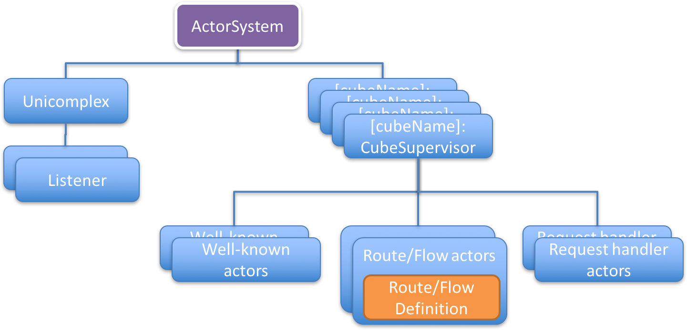

# Unicomplex Actor Hierarchy

squbs sets up the actor and component hierarchy shown in the above picture to support a modular runtime for actors and services running in a squbs system.

* **ActorSystem** - This is the pekko ActorSystem. A squbs system uses one single actor system to support all services and cubes. This will ensure that we have a single control point for dispatchers running in a squbs system. The ActorSystem name is "squbs" by default but can be overridden by overriding the settings in application.conf.

* **Unicomplex** - This is the core singleton actor that manages the squbs system. It registers all cubes and communicates with the web-service actor and the cube supervisors for lifecycle management of the system. It is also responsible for starting the web-service and service-registrar actors. Applications or system components can access the `ActorRef` of `Unicomplex` by calling `Unicomplex()`

* **Listeners** - The listeners creates the `Flow`s that handle incoming HTTP requests and bind them to the configured ports. They carry the name of the configured listeners in `reference.conf` or `application.conf`. By default, the default-listener binds port 8080 on address 0.0.0.0 (any interface) without using https. However, this can be overridden in `application.conf`. Additional listeners can be configured in `reference.conf` or `application.conf` of the library or application, respectively.

* **RouteDefinition/FlowDefinition** - `RouteDefinition` and `FlowDefinition` are both service definitions of different forms. A `RouteDefinition` defines the `Route` for a service whereas a `FlowDefinition` defines a `Flow`. These two are different types of request handlers handling incoming Http requests. Both `RouteDefinition` and `FlowDefinition` themselves are not actors, but a class extending their respective traits. They are registered by their respective services and are hosted by their corresponding actors.

* **Route/Flow actors** - Actors of type `org.squbs.unicomplex.RouteActor` or `org.squbs.unicomplex.FlowActor` created by the `CubeSupervisor` to host each corresponding `RouteDefinition` or `FlowDefinition`. Therefore, they become children supervised by the corresponding `CubeSupervisor` they belong to. Their request handlers are automatically registered against all the listeners they are bound to, allowing requests from the listeners to be dispatched to the corresponding request handlers.

* **Request handler actors** - Instead of using `RouteDefinition`/`FlowDefinition` for services, developers may choose to work at the low level API and thus register a request handler actor instead. Avoiding the high level routing API generally consumes less memory and allows handling of streaming requests but is harder to code when compared to the routing DSL.

* **CubeSupervisors** - `CubeSupervisors` are created directly from the actor system and register themselves with the `Unicomplex`. One instance of the `CubeSupervisor` is created per cube. They act as the supervisor for service handlers and registered (well-known) actors that can be looked up by name and handle errors and restarts for these actors. They are responsible for the lifecycle of their children. Well-known actors requiring initialization will declare such needs in the `squbs-meta.conf` file. They will communicate with their parent - the CubeSupervisor for their initialization status. The CubeSupervisor will again communicate lifecycle status and initialization updates to the `Unicomplex` which maintains the lifecycle state for the whole system. Please refer to [Bootstraping](bootstrap.md) for information about cube and service configuration entries in the `squbs-meta.conf` and [Runtime Lifecycle & API](lifecycle.md) for lifecycle states and lifecycle status updates. In addition, the cube structure also provides namespacing for well-known actors preventing naming conflicts between well-known actors supplied by different cubes. `RouteActor` and `FlowActor` are technically equivalent to well known actors.

* **Well-known actors** - These actors are registered actors that get started by the CubeSupervisor. They register and provide basic startup information such as routers through `squbs-meta`.conf. Please refer to [Bootstrapping](bootstrap.md) for detailed information about cube configuration. You can provide additional configuration through the cube's `reference.conf`. Please refer to the [Typesafe Config](https://github.com/typesafehub/config) library documentation for specification and details of `reference.conf` and `application.conf`.
