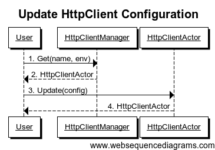

##Overview

squbs HttpClient is the library enabling Scala/Akka/Spray applications to easily execute HTTP requests and asynchronously process the HTTP responses in a managed environment. This means it provides environment awareness whether you're in development or in production, service routing which exact service endpoint should be accessed, and also service resilience ensuring that service quality is being maintained. It is build on the top of Akka and the spray layer.

##Concepts

###HttpClient
The HttpClient is primary interface for the application to call a web site or service. For ease of use and manageability, the following facilities are provided with the HttpClient:

* json4s native/jackson Marshalling/Unmarshalling.
* Service resilience
* Per-client configuration to easy support spray related configuration, SslContext, circuit breaker configuration and so on.
* HttpClient mark-up and mark-down.
* A HttpClientJMXBean to expose HttpClient/EndpointResolver/EnvironmentResolver/CircuitBreaker and mark-up/mark-down state information.

###EndpointResolver
The EndpointResolver is a resolver that maps a logical request to an endpoint. Generally, a service or web request on the internet does not be mapped. But a similar request inside an organization will need to be mapped based on a particular environment. For instance, a request to http://www.ebay.com/itm/0001 will be mapped to http://www.qa.ebay.com/itm/001 in the development and QA environments so as not to hit production data.

###EndpointRegistry
The EndpointRegistry is a registry keeping a sequence of resolvers and allowing resolvers to be registered at initialization time. This keeps the application code for resolution concise, easy to read, and easy to maintain. Resolvers will be tried one-by-one to map a request. This falls back to a default resolver that takes the request URL as is without modifications. 

###EnvironmentResolver
The EnvironmentResolver is a pluggable resolver that determines the environment of the endpoint to be called.

###EnvironmentRegistry
The EnvironmentRegistry keeps a sequence of EnvironmentResolvers, defaulting to a default resolver that does not resolve the environment allowing making straight calls.

###Pipeline
An infrastructure managing a sequence of pluggable handlers that would process requests/responses in sequence. From an HttpClient perspective, a request would be passed through the request pipeline which could in turn decorate the request or keep counters before sending the request out. In turn, the response also would be passed to the response pipeline to pre-process responses before handing the response to the application.

###Pipeline Handlers
Request/response handlers plugged into the pipeline. One example of a pipeline handler plugging into both the request and response pipeline is a tracing handler that adds a tracing request header to the request and reads the the tracing response header from the response. Assuming the endpoint also supports tracing, this would essentially allow service calls across multiple tiers to be stitched together for tracing and monitoring purposes.

Following are a few basic pipeline handlers provided with the HttpClient

* RequestCredentialsHandler
* RequestHeaderHandler
* ResponseHeaderHandler

## Getting Started

### Dependencies

Add the following dependency to your build.sbt or scala build file:

"org.squbs" %% "squbs-httpclient" % squbsVersion

### EndpointRegistry

Users could register multiple `EndpointResolver`s with the `EndpointRegistry`. The sequence of EndpointResolver to be tried is the reverse of the registration sequence. In other words, the last EndpointResolver registered has the highest priority and will be consulted first. If the endpoint cannot be resolved, the next to last EndpointResolve registered will be tried, in sequence. If the service name starts with "http://" or "https://" and is not resolved by any registered resolver, the service name itself will be used as the endpoint. This allows users to use a well known endpoint directly without any resolver registration, yet allows the resolver to make proper translations as needed.

The following is an example of an EndpointResolver:

```scala

object DummyLocalhostResolver extends EndpointResolver {
  override def resolve(svcName: String, env: Environment = Default): Option[Endpoint] = {
    if (svcName == null && svcName.length <= 0) throw new HttpClientException(700, "Service name cannot be null")
    env match {
      case Default | DEV => Some(Endpoint("http://localhost:8080/" + svcName))
      case _   => throw new HttpClientException(701, "DummyLocalhostResolver cannot support " + env + " environment")
    }
  }
  override def name: String = "DummyLocalhostResolver"
}

```
 
After defining the resolver, simply register the resolver with the EndpointRegistry:

```scala

EndpointRegistry.register(DummyLocalhostResolver)

```

### EnvironmentRegistry

The `EnvironmentRegistry` is used to resolve 'Default' environment to a particular environment such as 'Dev', 'QA' and 'Prod'. Users could register multiple EnvironmentResolvers. Similar to the EndpointResolver, The sequence of EnvironmentResolvers to be tried is the reverse of the registration sequence. If the environment cannot be resolved, it will fallback to 'Default'.

The following shows an example of an EnvironmentResolver:

```scala

object DummyPriorityEnvironmentResolver extends EnvironmentResolver {

  override def resolve(svcName: String): Option[Environment] = svcName match {
    case "abc" => Some(QA)
    case _ => None
  }

  override def name: String = "DummyPriorityEnvironmentResolver"
}

``` 
And here is how to register an EnvironmentResolver:

```scala

EnvironmentRegistry.register(DummyPriorityEnvironmentResolver)

```

### Service Resilience

Service resilience layer has been supported in HttpClient which is build on top of akka circuit breaker to stop cascading failure, provide fallback logic and enable resilience.

### HttpClient Message Based API

#### Get HttpClient

```scala

val httpClientManager = HttpClientManager(system: ActorSystem).httpClientManager
httpClientManager ! Get(name: String, env: Environment = Default)

```
- name(Mandatory): Service Name
- env(Optional): Service Call Environment, by default is Default

response:
- Success: HttpClientActor Reference

Note: If httpclient is not exist, it will create a new one.


#### Delete HttpClient

```scala

val httpClientManager = HttpClientManager(system: ActorSystem).httpClientManager
httpClientManager ! Delete(name: String, env: Environment = Default)

```
- name(Mandatory): Service Name
- env(Optional): Service Call Environment, by default is Default

response:
- Success: DeleteSuccess
- Failure: HttpClientNotExistException


#### Delete All HttpClients

```scala

val httpClientManager = HttpClientManager(system: ActorSystem).httpClientManager
httpClientManager ! DeleteAll

```

response:
- Success: DeleteAllSuccess


#### Get All HttpClients

```scala

val httpClientManager = HttpClientManager(system: ActorSystem).httpClientManager
httpClientManager ! GetAll

```

response:
- Success: TrieMap[(String, Environment), (Client, ActorRef)]


#### Update HttpClient Configuration

```scala

//get HttpClientActor Ref from Get HttpClient Message Call
httpClientActorRef ! Update(config: Configuration)

```
- config(Mandatory): new Configuration

response:
- Success: HttpClientActor Reference



#### MarkDown HttpClient

```scala

//get HttpClientActor Ref from Get HttpClient Message Call
httpClientActorRef ! MarkDown

```
response:
- Success: MarkDownSuccess


#### MarkUp HttpClient

```scala

//get HttpClientActor Ref from Get HttpClient Message Call
httpClientActorRef ! MarkUp

```
response:
- Success: MarkUpSuccess


#### Close HttpClient

```scala

//get HttpClientActor Ref from Get HttpClient Message Call
httpClientActorRef ! Close

```
response:
- Success: CloseSuccess


#### Use HttpClient Make HTTP Call

```scala

//get HttpClientActor Ref from Get HttpClient Message Call
httpClientActorRef ! Get(uri)

```
- uri(Mandatory): Uri for Service Call

response:
- Success: HttpResponse
- Failure: Throwable


```scala

//get HttpClientActor Ref from Get HttpClient Message Call
httpClientActorRef ! Head(uri)

```
- uri(Mandatory): Uri for Service Call

response:
- Success: HttpResponse
- Failure: Throwable


```scala

//get HttpClientActor Ref from Get HttpClient Message Call
httpClientActorRef ! Options(uri)

```
- uri(Mandatory): Uri for Service Call

response:
- Success: HttpResponse
- Failure: Throwable


```scala

//get HttpClientActor Ref from Get HttpClient Message Call
httpClientActorRef ! Delete(uri)

```
- uri(Mandatory): Uri for Service Call

response:
- Success: HttpResponse
- Failure: Throwable


```scala

//get HttpClientActor Ref from Get HttpClient Message Call
httpClientActorRef ! Put[T](uri: String, content: T, marshaller: Marshaller[T] = org.squbs.httpclient.json.Json4sJacksonNoTypeHintsProtocol.json4sMarshaller)

```
- uri(Mandatory): Uri for Service Call
- content(Mandatory): Put Content
- marshaller(Optional): By Default is org.squbs.httpclient.json.Json4sJacksonNoTypeHintsProtocol.json4sMarshaller

response:
- Success: HttpResponse
- Failure: Throwable


```scala

//get HttpClientActor Ref from Get HttpClient Message Call
httpClientActorRef ! Post[T](uri: String, content: T, marshaller: Marshaller[T] = org.squbs.httpclient.json.Json4sJacksonNoTypeHintsProtocol.json4sMarshaller)

```
- uri(Mandatory): Uri for Service Call
- content(Mandatory): Post Content
- marshaller(Optional): By Default is org.squbs.httpclient.json.Json4sJacksonNoTypeHintsProtocol.json4sMarshaller

response:
- Success: HttpResponse
- Failure: Throwable


#### Use HttpClient Make HTTP Call and return Unmarshall Object

```scala

//get httpResponse from the above Http Call
import org.squbs.httpclient.pipeline.HttpClientUnmarshal._
val result: T = httpResponse.unmarshalTo[T] //T is the unmarshall object

```

### HttpClient API

#### Get HttpClient

```scala

val client: HttpClient = HttpClientFactory.get(name: String, env: Environment = Default)

```
- name(Mandatory): Service Name
- env(Optional): Service Call Environment, by default is Default

Note: If httpclient is not exist, it will create a new one.

#### Update

Update Configuration:

```scala

val client: HttpClient = HttpClientFactory.get(name: String, env: Environment = Default).withConfig(config: Configuration)
val response: Future[HttpResponseWrapper] = client.get(uri: String)

```

#### MarkDown

```scala

client.markDown

```

#### MarkUp

```scala

client.markUp

```

#### Use HttpClient to make HTTP Call

```scala

val response: Future[HttpResponse] = client.get(uri: String)

```
- uri(Mandatory): Uri for Service Call

```scala

val response: Future[HttpResponse] = client.post[T](uri: String, content: T)

```
- uri(Mandatory): Uri for Service Call
- content(Mandatory): Post Content

```scala

val response: Future[HttpResponse] = client.put[T](uri: String, content: T)

```
- uri(Mandatory): Uri for Service Call
- content(Mandatory): Put Content

```scala

val response: Future[HttpResponse] = client.head(uri: String)

```
- uri(Mandatory): Uri for Service Call

```scala

val response: Future[HttpResponse] = client.delete(uri: String)

```
- uri(Mandatory): Uri for Service Call

```scala

val response: Future[HttpResponse] = client.options(uri: String)

```
- uri(Mandatory): Uri for Service Call


### Pipeline

The pipeline is a way for pre-processing the request as well as post-processing the response. The user can provide a request/response pipeline when calling service as follows:
 
```scala

object DummyRequestResponsePipeline extends Pipeline {
  override def requestPipelines: Seq[RequestTransformer] = Seq[RequestTransformer](RequestAddHeaderHandler(RawHeader("req2-name", "req2-value")).processRequest)
  override def responsePipelines: Seq[ResponseTransformer] = Seq[ResponseTransformer](ResponseAddHeaderHandler(RawHeader("res2-name", "res2-value")).processResponse)
}

```

By default, squbs HttpClient provides the below Request/Response Handlers.
- RequestCredentialsHandler (HttpCredentials Related)
- RequestAddHeaderHandler (Add Header in Request Phase)
- RequestRemoveHeaderHandler (Remove Header in Request Phase)
- RequestUpdateHeaderHandler (Update Header in Request Phase)
- ResponseAddHeaderHandler (Add Header in Response Phase)
- ResponseRemoveHeaderHandler (Remove Header in Response Phase)
- ResponseUpdateHeaderHandler (Update Header in Response Phase)

### Configuration

Configuration provides spray host related configuration and sslContext configuration.

Configuration
- pipeline (default is None)
- hostSettings (default is Configuration.defaultHostSettings)
- connectionType (default is ClientConnectionType.AutoProxied)
- sslContext (default is None)
- circuitBreakerConfig (default is Configuration.defaultCircuitBreakerConfig)

### Json4s Marshalling/Unmarshalling

Squbs HttpClient provides integration with Json4s Marshalling/Unmarshalling to support native/jackson Protocols. User don't limit to use Json4s for Marshalling/Unmarshalling.

Json4s Jackson Support:

- Json4sJacksonNoTypeHintsProtocol (NoTypeHints, user only need to import this object)
- Json4sJacksonShortTypeHintsProtocol (ShortTypeHints, user need to implement the trait)
- Json4sJacksonFullTypeHintsProtocol (FullTypeHints, user need to implement the trait)
- Json4sJacksonCustomProtocol (Customized, user need to implement the trait)

Json4s Native Support:

- Json4sNativeNoTypeHintsProtocol (NoTypeHints, user only need to import this object)
- Json4sNativeShortTypeHintsProtocol (ShortTypeHints, user need to implement the trait)
- Json4sNativeFullTypeHintsProtocol (FullTypeHints, user need to implement the trait)
- Json4sNativeCustomProtocol (Customized, user need to implement the trait)

### HttpClientJMXBean

HttpClientInfo:
- name
- env
- endpoint
- status
- connectionType
- maxConnections
- maxRetries
- maxRedirects
- requestTimeout
- connectingTimeout
- requestPipelines
- responsePipelines

```scala

val httpClients: java.util.List[HttpClientInfo] = HttpClientBean.getHttpClientInfo

```

EndpointresolverInfo:
- position
- resolver

```scala

val endpointResolvers: java.util.List[EndpointResolverInfo] = EndpointResolverBean.getHttpClientEndpointResolverInfo

```

EnvironmentResolverInfo:
- position
- resolver

```scala

val environmentResolvers: java.util.List[EnvironmentResolverInfo] = EnvironmentResolverBean.getHttpClientEnvironmentResolverInfo

```

CircuitBreakerInfo:
- name
- status
- lastDurationConfig
- successTimes
- fallbackTimes
- failFastTimes
- exceptionTimes
- lastDurationErrorRate
- lastDurationFailFastRate
- lastDuratoinExceptionRate

```scala

val circuitBreakers: java.util.List[CircuitBreakerInfo] = CircuitBreakerBean.getHttpClientCircuitBreakerInfo

```