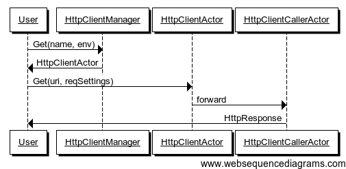

#Accessing Other Services using HTTP or HTTPS


##Table of Contents

- [Overview](#overview)
- [Dependencies](#dependencies)
- [Getting Started](#getting-started)
	- [Simple Scala API Samples:](#simple-scala-api-samples)
	- [Simple Java API Samples:](#simple-java-api-samples)
- [Concepts](#concepts)
	- [HttpClient](#httpclient)
	- [EndpointResolver](#endpointresolver)
	- [EndpointRegistry](#endpointregistry)
	- [EnvironmentResolver](#environmentresolver)
	- [EnvironmentRegistry](#environmentregistry)
	- [Pipeline](#pipeline)
	- [Pipeline Handlers](#pipeline-handlers)
- [API](#api)
	- [EndpointRegistry](#endpointregistry-1)
	- [EnvironmentRegistry](#environmentregistry-1)
	- [Service Resilience](#service-resilience)
	- [HttpClientPathBuilder](#httpclientpathbuilder)
	- [HttpClient API](#httpclient-api)
		- [Obtaining the HttpClient Instance](#obtaining-the-httpclient-instance)
		- [Update](#update)
		- [MarkDown](#markdown)
		- [MarkUp](#markup)
		- [readyFuture](#readyfuture)
		- [Making REST Calls](#making-rest-calls)
			- [GET](#get)
			- [POST](#post)
			- [PUT](#put)
			- [HEAD](#head)
			- [DELETE](#delete)
			- [OPTIONS](#options)
	- [Pipeline](#pipeline-1)
	- [Configuration](#configuration)
	- [Json4s Marshalling/Unmarshalling](#json4s-marshallingunmarshalling)
	- [Jackson Marshalling/Unmarshalling](#jackson-marshallingunmarshalling)
	- [HttpClient Configuration Precedence](#httpclient-configuration-precedence)
- [Statistics](#statistics)
	- [HttpClientJMXBean](#httpclientjmxbean)
- [Google API Sample](#google-api-sample)
- [Advanced APIs](#advanced-apis)
	- [HttpClient Message-Based API](#httpclient-message-based-api)
		- [Get HttpClient](#get-httpclient)
		- [Delete HttpClient](#delete-httpclient)
		- [Delete All HttpClients](#delete-all-httpclients)
		- [Get All HttpClients](#get-all-httpclients)
		- [Update HttpClient Configuration](#update-httpclient-configuration)
		- [Update HttpClient Settings](#update-httpclient-settings)
		- [Update HttpClient Pipeline](#update-httpclient-pipeline)
		- [Update HttpClient Circuit Breaker Settings](#update-httpclient-circuit-breaker-settings)
		- [Update HttpClient Fallback Response](#update-httpclient-fallback-response)
		- [MarkDown HttpClient](#markdown-httpclient)
		- [MarkUp HttpClient](#markup-httpclient)
		- [Close HttpClient](#close-httpclient)
		- [Use HttpClient to Make HTTP Calls](#use-httpclient-to-make-http-calls)
		- [Use HttpClient to Make HTTP Calls and Return Unmarshalled Objects](#use-httpclient-to-make-http-calls-and-return-unmarshalled-objects)
	- [Google API Sample](#google-api-sample-1)
		- [Main (Message Based API)](#main-message-based-api)


##Overview

squbs HttpClient is the library enabling Java/Scala/Akka/Spray applications to easily execute HTTP requests and asynchronously process the HTTP responses in a managed environment. This means it provides environment awareness whether you're in development or in production, service routing which exact service endpoint should be accessed, and also service resilience ensuring that service quality is being maintained. It is build on the top of Akka and the spray layer.

##Dependencies

Add the following dependency to your build.sbt or scala build file:

```
"org.squbs" %% "squbs-httpclient" % squbsVersion
```

##Getting Started

###Simple Scala API Samples:

```scala
import org.squbs.httpclient._

// Expecting an implicit actor system.
val getFuture: Future[String] = HttpClientFactory.get("http://foo.com").get("/mypath")
val postFuture: Future[String] = HttpClientFactory.get("http://foo.com").post("/mypath", Some("foo=bar"))
```

Lets add some explanations around such breakdown. The first `HttpClientFactory.get(name)` obtains you a HttpClient instance. While the name can often be a base URL of a certain site, it does not have to be. It can be any unique identifier to a HttpClient. Most applications or services do not call random sites, but rather a limited amount of other sites or services. These can also be different whether you work in you dev, QA, or production environment. So it is more practical to abstract out the site from the path.

Once you have the HttpClient, you can make any number of calls to different paths with it. This also facilitates connection pooling to these other services and allow easy re-use of the connections to a particular service.

###Simple Java API Samples:

We use the Scala `Future` API even for Java use cases. This is commonly used in Akka as well.

```java
import org.squbs.httpclient.japi.*;

// Need an actor system
Future<String> getFuture = HttpClientFactory.get("http://foo.com", system).get("/mypath");
Future<String> postFuture = HttpClientFactory.get("http://foo.com", system).
                            post("/mypath", Optional.of("foo=bar"));
```

Similar to the Scala version of the API, the HttpClientFactory provides an HttpClient by name. This name is often a URL, but does not have to be. It is the name of the service to call. Once obtained, you can now call get, post, put, delete, option on the HttpClient given a more specific path. The same client will share the same connection pool while a separate client may or may not share the connection pool depending on whether the framework can identify those clients to be the same endpoint or not.

The squbs API generally uses `Optional` to indicate an optional value. Nulls should never be passed.

The Scala `Future` allows functional processing. Please visit the [Akka Futures API page](http://doc.akka.io/docs/akka/2.3.13/java/futures.html) for a more complete description of how to use Futures from Java code.


##Concepts

###HttpClient
The HttpClient is primary interface for the application to call a web site or service. For ease of use and manageability, the following facilities are provided with the HttpClient:

* json4s native/jackson Marshalling/Unmarshalling.
* Service resilience
* Per-client configuration to easy support spray related configuration, SslContext, circuit breaker configuration, pipeline and so on.
* HttpClient mark-up and mark-down.
* A HttpClientJMXBean to expose HttpClient/EndpointResolver/EnvironmentResolver/CircuitBreaker and mark-up/mark-down state information.

###EndpointResolver
The EndpointResolver is a resolver that maps a logical request to an endpoint which include host, port and context path. Generally, a service or web request on the internet does not be mapped. But a similar request inside an organization will need to be mapped based on a particular environment. For instance, a request to http://www.ebay.com/itm/0001 will be mapped to http://www.qa.ebay.com/itm/001 in the development and QA environments so as not to hit production data.

###EndpointRegistry
The EndpointRegistry is a registry keeping a sequence of resolvers and allowing resolvers to be registered at initialization time. This keeps the application code for resolution concise, easy to read, and easy to maintain. Resolvers will be tried one-by-one to map a request. This falls back to a default resolver that takes the request URL as is without modifications.

###EnvironmentResolver
The EnvironmentResolver is a pluggable resolver that determines the environment of the endpoint to be called.

###EnvironmentRegistry
The EnvironmentRegistry keeps a sequence of EnvironmentResolvers, defaulting to a default resolver that does not resolve the environment allowing making straight calls.

###Pipeline
An infrastructure managing a sequence of pluggable handlers that would process requests/responses in sequence. From an HttpClient perspective, a request would be passed through the request pipeline which could in turn decorate the request or keep counters before sending the request out. In turn, the response also would be passed to the response pipeline to pre-process responses before handing the response to the application.

###Pipeline Handlers
Request/response handlers plugged into the pipeline. One example of a pipeline handler plugging into both the request and response pipeline is a tracing handler that adds a tracing request header to the request and reads the tracing response header from the response. Assuming the endpoint also supports tracing, this would essentially allow service calls across multiple tiers to be stitched together for tracing and monitoring purposes.

Following are a few basic pipeline handlers provided with the HttpClient

* `RequestCredentialsHandler` Validates credentials
* `RequestHeaderHandler` Add, update, or delete headers on request
* `ResponseHeaderHandler` Add, update, or delete headers on response

## API

### EndpointRegistry

Users could register multiple `EndpointResolver`s with the `EndpointRegistry` per actor system. The sequence of EndpointResolver to be tried is the reverse of the registration sequence. In other words, the last EndpointResolver registered has the highest priority and will be consulted first. If the endpoint cannot be resolved, the next to last EndpointResolver registered will be tried, in sequence. If the service name starts with "http://" or "https://" and is not resolved by any registered resolver, the service name itself will be used as the endpoint. This allows users to use a well known endpoint directly without any resolver registration, yet allows the resolver to make proper translations as needed.

The following is an example of an EndpointResolver:

**Scala**

```scala

class DummyLocalhostResolver(implicit system: ActorSystem) extends EndpointResolver {
  override def resolve(svcName: String, env: Environment = Default): Option[Endpoint] = {
    if (svcName == null || svcName.length <= 0)
      throw new HttpClientException(700, "Service name cannot be null")
    env match {
      case Default | DEV =>
        Some(Endpoint("http://localhost:8080/" + svcName))
      case _   =>
        throw new HttpClientException(701, "DummyLocalhostResolver cannot support " + env + " environment")
    }
  }
  override def name: String = "DummyLocalhostResolver"
}

```

**Java**

```java

public class DummyLocalhostResolver extends AbstractEndpointResolver{

    private ActorSystem system;

    public DummyLocalhostResolver(ActorSystem system) {
        this.system = system;
    }

    @Override
    public String name() {
        return "DummyLocalhostResolver";
    }

    @Override
    public Option<Endpoint> resolve(String svcName, Environment env) {
        if (svcName == null || svcName.length() <= 0) {
            throw new HttpClientException("Service name cannot be null");
        }
        if(env == Default.value() || env == DEV.value()) {
            return Option.apply(EndpointFactory.create("http://localhost:8080/" + svcName, system));
        } else {
            throw new HttpClientException("DummyLocalhostResolver cannot support " +
                env + " environment");
        }
    }
}

```
After defining the resolver, simply register the resolver with the EndpointRegistry:

**Scala**

```scala

EndpointRegistry(actorSystem).register(DummyLocalhostResolver)

```
**Java**

```java

EndpointRegistryExtension registry = (EndpointRegistryExtension) EndpointRegistry.get(actorSystem);
registry.register(new DummyLocalhostResolver());

```


### EnvironmentRegistry

The `EnvironmentRegistry` is used to resolve 'Default' environment to a particular environment such as 'Dev', 'QA' and 'Prod'. Users could register multiple EnvironmentResolvers. Similar to the EndpointResolver, The sequence of EnvironmentResolvers to be tried is the reverse of the registration sequence. If the environment cannot be resolved, it will fallback to 'Default'.

The following shows an example of an EnvironmentResolver:

**Scala**

```scala

object DummyPriorityEnvironmentResolver extends EnvironmentResolver {

  override def resolve(svcName: String): Environment = svcName match {
    case "abc" => QA
    case _ => Default
  }

  override def name: String = "DummyPriorityEnvironmentResolver"
}

```

**Java**

```java
public class DummyPriorityEnvironmentResolver implements EnvironmentResolver {
    @Override
    public String name() {
        return "DummyPriorityEnvironmentResolver";
    }

    @Override
    public Environment resolve(String svcName) {
        if("abc".equals(svcName)) return QA.value();
        else return Default.value();
    }
}

```

And here is how to register an EnvironmentResolver:

**Scala**

```scala

EnvironmentRegistry(actorSystem).register(DummyPriorityEnvironmentResolver)

```

**Java**

```java
EnvironmentRegistryExtension registry = (EnvironmentRegistryExtension)EnvironmentRegistry.get(actorSystem);
registry.register(new DummyPriorityEnvironmentResolver());

```

### Service Resilience

All httpclient service requests go through a resilience layer built on top of Akka circuit breaker. This ensures cascading failures are not propagated. Failing service calls or calls timing out will trip the circuit breaker disallowing subsequent service calls from overloading the service in question. Subsequent calls will go into fail-fast mode. The circuit breaker will restore its state once the service is responding again. It works as per the state diagram below:


Please see [Akka Circuit Breaker](http://doc.akka.io/docs/akka/2.3.13/common/circuitbreaker.html) for a more detailed explanation of the circuit breaker semantics.

In addition, the service resilience layer allows specifying a fallback service response in case of a tripped circuit breaker. This is provided as part of the HttpClient or circuit breaker configuration as follows:

####Scala

```scala
val fallback = HttpResponse(entity = """{ "defaultResponse" : "Some default" }""")

// Configure the HttpClient directly...
val httpClient = HttpClientFactory.get("MyClient").withFallbackResponse(Some(fallback))

// Or configure the endpoint and register an endpoint resolver...
val endpoint = Endpoint("http://maps.googleapis.com/maps").withFallbackResponse(Some(fallback))
```


####Java

```java
HttpResponse fallback = new HttpResponseBuilder().
                        entity("{ \"defaultResponse\" : \"Some default\" }");

// Configure the HttpClient directly...
HttpClientFactory.get("MyClient", system).
    withFallbackResponse(Optional.of(fallback));

// Or configure the endpoint and register the endpoint resolver...
EndpointFactory.create("http://maps.googleapis.com/maps", system).
    withFallbackResponse(Optional.of(fallback));
```

### HttpClientPathBuilder

HttpClientPathBuilder is a utility trait used to generate uri path based on the path & param map, it will automatically handle encoding. Right now the param map only support the below value type:

* String
* Double
* Float
* Int
* Short
* Byte
* Char
* Boolean

To use HttpClientPathBuilder, simply extend the HttpClientPathBuilder and use the function `buildRequestURI` as in the following examples:

```scala
  buildRequestURI("/foo/", Map("n1" -> "v1", "n2" -> 12.345))
```

This should yield `"/foo/?n1=v1&n2=12.345"`. Since this API makes use of the compactness of Scala, it may not be very useful for Java code.

### HttpClient API

This is the API most developers would interact with. Most of the API is Future-based allowing developers to make calls asynchronously.

#### Obtaining the HttpClient Instance

The first step to all HttpClient calls is to obtain the HttpClient from the factory.

**Scala**

```scala
import org.squbs.httpclient._
...
val client: HttpClient = HttpClientFactory.get(name: String, env: Environment = Default)
```
- name(Mandatory): Service Name
- env(Optional): Service Call Environment, by default is Default

Note: If httpClient does not exist, it will create a new one.

**Java**

```java
import org.squbs.httpclient.japi.*;
...
//Needs an ActorSystem, system.
HttpClient client = HttpClientFactory.get(String name, Environment env, ActorSystem system);

//or the shortcut with default environment
HttpClient client = HttpClientFactory.get(String name, ActorSystem system);
```


#### Update

HttpClient update operations asynchronously change the configuration/settings of the client. The client returned with this update operation will follow the new configuration. Other client references will be affected by such changes in a near future client operation. This will not affect the client operation in flight and may not even affect the subsequent operation, dependent on timing.

#####Scala

Update Configuration:

```scala
val client: HttpClient = HttpClientFactory.get(name: String, env: Environment = Default).
                         withConfig(config: Configuration)
```

Update Settings:

```scala
val client: HttpClient = HttpClientFactory.get(name: String, env: Environment = Default).
                         withSettings(settings: Settings)
```

Update Pipeline:

```scala
val client: HttpClient = HttpClientFactory.get(name: String, env: Environment = Default).
                         withPipeline(pipeline: Option[SimplePipelineConfig])
```

Update Circuit Breaker Config:

```scala
val client: HttpClient = HttpClientFactory.get(name: String, env: Environment = Default).
                         withCircuitBreakerSettings(settings: CircuitBreakerSettings)
```

Update Fallback Response:

```scala
val client: HttpClient = HttpClientFactory.get(name: String, env: Environment = Default).
                         withFallbackResponse(response: Option[HttpResponse])
```

#####Java

Update Configuration:

```java
HttpClient client = HttpClientFactory.get(name, system).
                    withConfig(config);
```

Update Settings:

```java
HttpClient client = HttpClientFactory.get(name, system).
                    withSettings(settings);
```

Update Pipeline:

```java
HttpClient client = HttpClientFactory.get(name, system).
                    withPipeline(Optional.of(pipeline));
```

Update Circuit Breaker Config:

```java
HttpClient client = HttpClientFactory.get(name, system).
                    withCircuitBreakerSettings(cbSettings);
```

Update Fallback Response:

```java
HttpClient client = HttpClientFactory.get(name, system).
                    withFallbackResponse(Optional.of(response));
```

#### MarkDown

**Scala**

```scala
val status: Future[MarkDownSuccess.type] = client.markDown
```

**Java**

```java
Future<HttpClientActorMessage.MarkDownSuccess$> success = client.markDown();
```

The type `HttpClientActorMessage.MarkDownSuccess$` is usually not used. We usually attach an `onComplete` callback such as `client.markUp().onComplete(...)`
directly.

#### MarkUp

**Scala**

```scala
val status: Future[MarkUpSuccess.type] = client.markUp
```

**Java**

```java
Future<HttpClientActorMessage.MarkUpSuccess$> success = client.markUp();
```

The type `HttpClientActorMessage.MarkUpSuccess$` is usually not used. We usually attach a onComplete callback such as `client.markUp().onComplete(...)`
directly.

#### readyFuture

The ready future is just to check that the HttpClient is actually in ready state. This means all its construction and changes are complete.

**Scala**

```scala
val result: Future[Unit] = client.readyFuture
```

**Java**

```java
Future<BoxedUnit> ready = client.readyFuture();
```

The type `BoxedUnit` is rarely used. Users would just attach callbacks to `client.readyFuture()` or just wait for it. So the types here is just for completeness.


#### Making REST Calls

HttpClient REST calls generally come in two-styles:

1. Deserialized - the results are deserialized into the target type requested by the user. For these operations, the expected type is passed to the REST operation in question. Scala can also infer the expected type by the type of the assignment resulting from the REST call. The result of REST calls are always a Scala `Future[T]` or `Future<T>` in Java where `T` is the expected type. A few examples for such calls is shown below.

   ```scala
   val client = HttpClientFactory.get("TransactionService")
   val txFuture = client.get[Transaction]("/tx/110215_1234")

   // Alternatively, you can also annotate the type of txFuture
   // without having to pass the type.

   val txFuture: Future[Transaction] = client.get("/tx/110215_1234")
   ```

   Similar Java calls will be as follows:

   ```java
   HttpClient client = HttpClientFactory.get("TransactionService", system);
   Future<Transaction> = client.get("TransactionService", Transaction.class);

   // If the system does not know how to deserialize Transaction.class, you will
   // want to provide the call with a deserializer.

   // Obtain the deserializer using the Spray utility.
   Deserializer<HttpResponse, Transaction> txDeserializer =
       ClassSupport.classToFromResponseUnmarshaller(Transaction.class);
   Future<Transaction> = client.get("TransactionService", txDeserializer);
   ```

2. Raw calls - the results are always of type `Future[HttpResponse]` or `Future<HttpResponse>` in Java. To get a raw `HttpClient`, just call `HttpClient.raw` and call REST operations based on the raw client.

All calls have an option to pass a `RequestSettings` instance to configure the particular request. Java calls also allowing passing explicit marshallers and unmarshallers (except for raw calls).

#####GET

**Scala**

```scala
val t: Future[T] = client.get[T](uri: String)
val t: Future[T] = client.get[T](uri: String, settings: RequestSettings)
val response: Future[HttpResponse] = client.raw.get(uri: String)
val response: Future[HttpResponse] = client.raw.get(uri: String, settings: RequestSettings)
```

**Java**

```java
Future<T> response = client.get(String uri, Class<T> responseType);
Future<T> response = client.get(String uri, RequestSettings settings, Class<T> responseType);
Future<T> response = client.get(String uri, Deserializer<HttpResponse, T> unmarshaller);
Future<T> response = client.get(String uri, RequestSettings settings,
                                Deserializer<HttpResponse, T> unmarshaller);
Future<HttpResponse> response = client.raw().get(String uri);
Future<HttpResponse> response = client.raw().get(String uri, RequestSettings settings);
```

- uri(Mandatory): Uri path for Service Call
- settings(Optional): Request Settings, default value is Configuration.defaultRequestSettings
- responseType: Implicitly deserializable types
- unmarshaller: An explicit deserializer

#####POST

**Scala**

```scala
val t: Future[T] = client.post[T](uri: String, content: Option[T])
val t: Future[T] = client.post[T](uri: String, content: Option[T], settings: RequestSettings)
val response: Future[HttpResponse] = client.raw.post(uri: String, content: Option[T])
val response: Future[HttpResponse] = client.raw.post(uri: String, content: Option[T], 
                                                     settings: RequestSettings)
```

**Java**

```java
Future<T> response = client.post(String uri, Optional<T> content, Class<T> responseType);
Future<T> response = client.post(String uri, Optional<T> content, RequestSettings settings, 
                                 Class<T> responseType);
Future<T> response = client.post(String uri, Optional<T> content, Marshaller<T> marshaller,
                                 Deserializer<HttpResponse, R> unmarshaller);
Future<T> response = client.post(String uri, Optional<T> content, RequestSettings settings,
                                 Marshaller<T> marshaller,
                                 Deserializer<HttpResponse, R> unmarshaller);
Future<HttpResponse> response = client.raw().post(String uri, Optional<T> content);
Future<HttpResponse> response = client.raw().post(String uri, Optional<T> content, 
                                                  RequestSettings settings);
Future<HttpResponse> response = client.raw().post(String uri, Optional<T> content, 
                                                  Marshaller<T> marshaller);
Future<HttpResponse> response = client.raw().post(String uri, Optional<T> content, 
                                                  RequestSettings settings, 
                                                  Marshaller<T> marshaller);
```

- uri(Mandatory): Uri path for service call
- content(Mandatory): Post content. It is an [Option](http://www.scala-lang.org/api/current/index.html#scala.Option) in Scala and [Optional](https://docs.oracle.com/javase/8/docs/api/java/util/Optional.html) in Java
- settings(Optional): Request Settings, default value is Configuration.defaultRequestSettings
- responseType: Java API only, a response class. The system will try to implicitly do the serialization.
- marshaller: An explicit request marshaller.
- unmarshaller: An explicit response unmarshaller.

#####PUT

**Scala**

```scala
val t: Future[T] = client.put[T](uri: String, content: Option[T])
val t: Future[T] = client.put[T](uri: String, content: Option[T], settings: RequestSettings)
val response: Future[HttpResponse] = client.raw.put(uri: String, content: Option[T])
val response: Future[HttpResponse] = client.raw.put(uri: String, content: Option[T],
                                                    settings: RequestSettings)
```

**Java**

```java
Future<T> response = client.put(String uri, Optional<T> content, Class<T> responseType);
Future<T> response = client.put(String uri, Optional<T> content, RequestSettings settings,
                                Class<T> responseType);
Future<T> response = client.put(String uri, Optional<T> content, Marshaller<T> marshaller,
                                Deserializer<HttpResponse, R> unmarshaller);
Future<T> response = client.put(String uri, Optional<T> content, RequestSettings settings,
                                Marshaller<T> marshaller,
                                Deserializer<HttpResponse, R> unmarshaller);
Future<HttpResponse> response = client.raw().put(String uri, Optional<T> content);
Future<HttpResponse> response = client.raw().put(String uri, Optional<T> content, 
                                                 RequestSettings settings);
Future<HttpResponse> response = client.raw().put(String uri, Optional<T> content,
                                                 Marshaller<T> marshaller);
Future<HttpResponse> response = client.raw().put(String uri, Optional<T> content,
                                                 RequestSettings settings,
                                                 Marshaller<T> marshaller);
```

- uri(Mandatory): Uri path for Service Call
- content(Mandatory):  Put content. It is an [Option](http://www.scala-lang.org/api/current/index.html#scala.Option) in Scala and [Optional](https://docs.oracle.com/javase/8/docs/api/java/util/Optional.html) in Java- settings(Optional): Request Settings, default value is Configuration.defaultRequestSettings
- responseType: Java API only, a response class. The system will try to implicitly do the serialization
- marshaller: An explicit marshaller
- unmarshaller: An explicit unmarshaller

#####HEAD

The HEAD operation is only available in the raw form of the HttpClient as it can only return a Future of HttpResponse. The HEAD operation never returns any content.

**Scala**

```scala
val response: Future[HttpResponse] = client.raw.head(uri: String)
val response: Future[HttpResponse] = client.raw.head(uri: String, settings: RequestSettings)
```

**Java**

```java
Future<HttpResponse> response = client.raw().head(String uri);
Future<HttpResponse> response = client.raw().head(String uri, RequestSettings settings);
```

- uri(Mandatory): Uri path for Service Call
- settings(Optional): Request Settings, default value is Configuration.defaultRequestSettings

#####DELETE

**Scala**

```scala
val t: Future[T] = client.delete[T](uri: String)
val t: Future[T] = client.delete[T](uri: String, settings: RequestSettings)
val response: Future[HttpResponse] = client.raw.delete(uri: String)
val response: Future[HttpResponse] = client.raw.delete(uri: String, settings: RequestSettings)
```

**Java**

```java
Future<T> response = client.delete(String uri, Class<T> responseType);
Future<T> response = client.delete(String uri, RequestSettings settings, Class<T> responseType);
Future<T> response = client.delete(String uri, Deserializer<HttpResponse, T> unmarshaller);
Future<T> response = client.delete(String uri, RequestSettings settings,
                                   Deserializer<HttpResponse, T> unmarshaller);
Future<HttpResponse> response = client.raw().delete(String uri);
Future<HttpResponse> response = client.raw().delete(String uri, RequestSettings settings);
```

- uri(Mandatory): Uri path for Service Call
- settings(Optional): Request Settings, default value is Configuration.defaultRequestSettings
- responseType: Implicitly deserializable types
- unmarshaller: An explicit deserializer

#####OPTIONS

**Scala**

```scala
val t: Future[T] = client.options[T](uri: String)
val t: Future[T] = client.options[T](uri: String, settings: RequestSettings)
val response: Future[HttpResponse] = client.raw.options(uri: String)
val response: Future[HttpResponse] = client.raw.options(uri: String, settings: RequestSettings)
```

**Java**

```java
Future<T> response = client.options(String uri, Class<T> responseType);
Future<T> response = client.options(String uri, RequestSettings settings, Class<T> responseType);
Future<T> response = client.options(String uri, Deserializer<HttpResponse, T> unmarshaller);
Future<T> response = client.options(String uri, RequestSettings settings,
                                    Deserializer<HttpResponse, T> unmarshaller);
Future<HttpResponse> response = client.raw().options(String uri);
Future<HttpResponse> response = client.raw().options(String uri, RequestSettings settings);
```

- uri(Mandatory): Uri path for Service Call
- settings(Optional): Request Settings, default value is Configuration.defaultRequestSettings
- responseType: Implicitly deserializable types
- unmarshaller: An explicit deserializer

### Pipeline

The pipeline is a way for pre-processing the request as well as post-processing the response. The user can provide a request/response pipeline when calling service as follows:

```scala
object DummyRequestResponsePipeline extends SimplePipelineConfig(
  Seq(new RequestAddHeaderHandler(RawHeader("req2-name", "req2-value"))),
  Seq(new ResponseAddHeaderHandler(RawHeader("res2-name", "res2-value")))
)
```

By default, squbs HttpClient provides the below Request/Response Handlers.

- `RequestCredentialsHandler` Validates http credentials
- `RequestAddHeaderHandler` Adds Header in Request Phase
- `RequestRemoveHeaderHandler` Removes Header in Request Phase
- `RequestUpdateHeaderHandler` Updates Header in Request Phase
- `ResponseAddHeaderHandler` Adds Header in Response Phase
- `ResponseRemoveHeaderHandler` Removes Header in Response Phase
- `ResponseUpdateHeaderHandler` Updates Header in Response Phase

### Configuration

Configuration provides spray host related settings, sslContext settings, circuit breaker settings and pipeline. The configuration structure is as follows:

* `Configuration`
   * `Settings`
      * `hostSettings` (default is `Configuration.defaultHostSettings`)
      * `connectionType` (default is `ClientConnectionType.AutoProxied`)
      * `sslContext` (default is `None`)
      * `circuitBreakerConfig` (default is `Configuration.defaultCircuitBreakerConfig`)
   * `Pipeline` (`Option`, default is `None`)

### Json4s Marshalling/Unmarshalling

squbs HttpClient provides integration with Json4s marshalling/unmarshalling to support JSON requests and responses. However, users are not limited to use Json4s for Marshalling/Unmarshalling. Any other framework can be used directy by implementing Spray marshallers and unmarshallers. The following are mechanisms provided by Json4s:

Json4s Jackson Support:

- `Json4sJacksonNoTypeHintsProtocol` NoTypeHints, user just needs to import this object
- `Json4sJacksonShortTypeHintsProtocol` ShortTypeHints, user needs to implement the trait
- `Json4sJacksonFullTypeHintsProtocol` FullTypeHints, user needs to implement the trait
- `Json4sJacksonCustomProtocol` Customized, user need to implement the trait

Json4s Native Support:

- `Json4sNativeNoTypeHintsProtocol` NoTypeHints, user just needs to import this object
- `Json4sNativeShortTypeHintsProtocol` ShortTypeHints, user needs to implement the trait
- `Json4sNativeFullTypeHintsProtocol` FullTypeHints, user needs to implement the trait
- `Json4sNativeCustomProtocol` Customized, user needs to implement the trait

### Jackson Marshalling/Unmarshalling

Squbs HttpClient provides JacksonProtocol to support Java Bean Marshalling/Unmarshalling. This is useful for Java developers in case the object to be serialized is not an instance of a Scala case class.

It is strongly suggested all squbs classes used for communication between actors or for serialization be immutable. A Java Bean used for such purposes should have fields be `final`, set at construction, and only provide getters and no setters as the following example:

```java
    static class Location {

        private final double lat, lng;

        public Location(double lat, double lng) {
            this.lat = lat;
            this.lng = lng;
        }

        public double getLat() {
            return lat;
        }

        public double getLng() {
            return lng;
        }
    }
```

Normally, constructors for such Java Beans would need to be annotated with `@JsonCreator` Jackson annotation. This requirement is however lifted provided certain rules are followed. These rules are highly recommended:

1. The bean class must be compiled by Java 8.
2. The `-parameters` option is provided to the compiler. This can be set as follows in your sbt build:

   ```
   javacOptions += "-parameters"
   ```

   It has to be set in the IDE as Java compiler parameters, too.
3. There should be only one constructor.
4. The version of `jackson-databind` must be `2.6.3` or higher.
5. Your dependencies must include `jackson-module-parameter-names` as follows:

   ```
   "com.fasterxml.jackson.module" % "jackson-module-parameter-names" % "2.6.3"
   ```

Please see [jackson-module-parameter-names](https://github.com/FasterXML/jackson-module-parameter-names) and Jackson in general for more information about serialization.

### HttpClient Configuration Precedence

The configuration precedence in the HttpClient Configuration is as follows:

1. RequestSettings
2. withConfig API
3. Endpoint Configuration in EndpointResolver
4. Spray Configuration override in application.conf
5. reference.conf in spray-can jar

The following are examples of overrides:

Request settings could provide request timeout and HttpHeaders for that request.

```scala
val httpClient: HttpClient = HttpClientFactory.get(name: String)
val futureT: Future[T] = httpClient.get[T](uri: String, reqSettings: RequestSettings)
```

withConfig/UpdateConfig API could provide HttpClient Configuration override.

```scala
val httpClient: HttpClient = HttpClientFactory.get(name: String).
                             withConfig(config: Configuration)
```

Endpoint Configuration in EndpointResolver

```scala
object XXXEndpointResolver extends EndpointResolver {
    override def resolve(svcName: String, env: Environment = Default): Option[Endpoint] = {
      if (svcName == name)
        Some(Endpoint(uri: String, config: Configuration))
      else
        None
    }

    override def name: String = "xxx"
  }
```

Spray Configuration override in application.conf

```
spray.can.client {
  request-timeout = 20 s
}
```

Spray default request-timeout is 20s, connection-timeout is 10s, please refer to the spray-can reference.conf as described in the [Spray configuration documentation](http://spray.io/documentation/1.2.3/spray-can/configuration/).

## Statistics

The squbs HttpClient exposes the following statistics via JMX beans:

### HttpClientJMXBean

HttpClientInfo:

* name
* env
* endpoint
* status
* connectionType
* maxConnections
* maxRetries
* maxRedirects
* requestTimeout
* connectingTimeout
* requestPipelines
* responsePipelines

```scala
val httpClients: java.util.List[HttpClientInfo] =
  (new HttpClientBean(actorSystem)).getHttpClientInfo
```

EndpointresolverInfo:
- position
- resolver

```scala
val endpointResolvers: java.util.List[EndpointResolverInfo] = 
  (new EndpointResolverBean(actorSystem)).getHttpClientEndpointResolverInfo
```

EnvironmentResolverInfo:
- position
- resolver

```scala
val environmentResolvers: java.util.List[EnvironmentResolverInfo] = 
  (new EnvironmentResolverBean(actorSystem)).getHttpClientEnvironmentResolverInfo
```

CircuitBreakerInfo:

* name - the HttpClient name
* status - string representing the current status
* historyUnitDuration - default is 1 minute buckets
* successTimes - total success count
* fallbackTimes - total fallback count
* failFastTimes - total fail-fast count
* exceptionTimes - total exception count
* history - list of history info, by default 5 entries of 1 minute each

Where history is a list of CBHistory with the following fields:

* period - A string describing the period like *1 minute-to-date*, *previous 1 minute*
* successes - successes for this period
* fallbacks - fallbacks for this period
* failFasts - fail-fasts for this period
* exceptions - exceptions for this period
* errorRate - rate of non-successes including fallback, fail-fasts, and exceptions, in percent of all responses
* failFastRate - rate of fail-fasts
* exceptionRate - rate of exceptions

```scala
val circuitBreakers: java.util.List[CircuitBreakerInfo] = 
  (new CircuitBreakerBean(actorSystem)).getHttpClientCircuitBreakerInfo
```

### Google API Sample

####Scala

#####Provide Endpoint Resolver for google api

```scala
object GoogleMapAPIEndpointResolver extends EndpointResolver {
  override def resolve(svcName: String, env: Environment = Default): Option[Endpoint] = {
    if (svcName == name)
      Some(Endpoint("http://maps.googleapis.com/maps"))
    else
      None
  }

  override def name: String = "GoogleMap"
}
```

##### Main

```scala
object HttpClientDemo1 extends App {

  implicit val system = ActorSystem("HttpClientDemo1")
  implicit val timeout: Timeout = 3 seconds
  import system.dispatcher
  EndpointRegistry(system).register(GoogleMapAPIEndpointResolver)

  val response = HttpClientFactory.get("GoogleMap").raw.
                 get("/api/elevation/json?locations=27.988056,86.925278&sensor=false")
  response onComplete {
    case Success(res@HttpResponse(StatusCodes.OK, _, _, _)) =>
      println("Success, response entity is: " + res.entity.asString)
      system.shutdown
    case Success(res@HttpResponse(code, _, _, _)) =>
      println("Success, the status code is: " + code)
      system.shutdown
    case Failure(e) =>
      println("Failure, the reason is: " + e.getMessage)
      system.shutdown
  }
}
```

##### Main (unmarshal api)

```scala
object HttpClientDemo2 extends App {

  implicit val system = ActorSystem("HttpClientDemo2")
  implicit val timeout: Timeout = 3 seconds
  import system.dispatcher
  EndpointRegistry(system).register(GoogleMapAPIEndpointResolver)
  import org.squbs.httpclient.json.Json4sJacksonNoTypeHintsProtocol._
  val response = HttpClientFactory.get("GoogleMap").get[GoogleApiResult[Elevation]](
    "/api/elevation/json?locations=27.988056,86.925278&sensor=false")
  response onComplete {
    case Success(data: GoogleApiResult[Elevation]) =>
      println("Success, elevation is: " + data.results.head.elevation)
      system.shutdown
    case Failure(e) =>
      println("Failure, the reason is: " + e.getMessage)
      system.shutdown
  }
}
```

##### Provide case class for google api unmarshal

```scala
case class Elevation(location: Location, elevation: Double)
case class Location(lat: Double, lng: Double)
case class GoogleApiResult[T](status: String, results: List[T])
```

####Java

#####Provide Endpoint Resolver for google api

```java
import akka.actor.ActorSystem;
import org.squbs.httpclient.endpoint.Endpoint;
import org.squbs.httpclient.env.Environment;
import org.squbs.httpclient.japi.AbstractEndpointResolver;
import org.squbs.httpclient.japi.EndpointFactory;
import scala.Option;

public class GoogleMapAPIEndpointResolver extends AbstractEndpointResolver {

    private final ActorSystem system;

    public GoogleMapAPIEndpointResolver(ActorSystem system) {
        this.system = system;
    }

    @Override
    public String name() {
        return "GoogleMap";
    }

    @Override
    public Option<Endpoint> resolve(String svcName, Environment env) {
        Option<Endpoint> response;
        if (name().equals(svcName))
            response = Option.apply(EndpointFactory.
              create("http://maps.googleapis.com/maps", system));
        else
            response = Option.empty();
        return response;
    }
}
```

##### Main

```java
import akka.actor.ActorSystem;
import akka.dispatch.OnComplete;
import org.squbs.httpclient.endpoint.EndpointRegistry;
import org.squbs.httpclient.japi.HttpClientFactory;
import scala.concurrent.Future;
import spray.http.HttpResponse;
import spray.http.StatusCodes;

public class HttpClientDemo1 {

    public static void main(String[] args) {
        final ActorSystem system = ActorSystem.apply("HttpClientDemo1");
        EndpointRegistry.get(system).register(new GoogleMapAPIEndpointResolver(system));
        Future<HttpResponse> responseFuture = HttpClientFactory.get("GoogleMap", system).raw().
                get("/api/elevation/json?locations=27.988056,86.925278&sensor=false");
        responseFuture.onComplete(new OnComplete<HttpResponse>() {
            public void onComplete(Throwable failure, HttpResponse response) {
                if (failure == null) {
                    if (response.status() == StatusCodes.OK()) {
                        System.out.println("Success, response entity is: " + response.entity().asString());
                    } else {
                        System.out.println("Success, the status code is: " + response.status());
                    }
                } else {
                    System.out.println("Failure, the reason is: " + failure.getMessage());
                }
                system.shutdown();
            }
        }, system.dispatcher());
    }
}
```

##### Main (unmarshal api)

```java
import akka.actor.ActorSystem;
import akka.dispatch.OnComplete;
import org.squbs.httpclient.endpoint.EndpointRegistry;
import org.squbs.httpclient.japi.HttpClientFactory;
import scala.concurrent.Future;

import java.util.Collections;
import java.util.List;

public class HttpClientDemo2 {

    public static void main(String[] args) {
        final ActorSystem system = ActorSystem.apply("HttpClientDemo1");
        EndpointRegistry.get(system).register(new GoogleMapAPIEndpointResolver(system));
        Future<ElevationResult> responseFuture = HttpClientFactory.get("GoogleMap", system).
                get("/api/elevation/json?locations=27.988056,86.925278&sensor=false", 
                    ElevationResult.class);
        responseFuture.onComplete(new OnComplete<ElevationResult>() {
            public void onComplete(Throwable failure, ElevationResult data) {
                if (failure == null) {
                    System.out.println("Success, elevation is: " + data.getResults().get(0));
                } else {
                    System.out.println("Failure, the reason is: " + failure.getMessage());
                }
                system.shutdown();
            }
        }, system.dispatcher());
    }

    // Now we need to define all the deserialized types we use for
    // communicating with Google Maps. For convenience, we use static
    // inner classes. But this is not required.

    static class Location {

        private final double lat, lng;

        public Location(double lat, double lng) {
            this.lat = lat;
            this.lng = lng;
        }

        public double getLat() {
            return lat;
        }

        public double getLng() {
            return lng;
        }
    }

    static class Elevation {

        private final double elevation;
        private final Location location;
        private final double resolution;

        public Elevation(double elevation, Location location, double resolution) {
            this.location = location;
            this.elevation = elevation;
            this.resolution = resolution;
        }

        public double getElevation() {
            return elevation;
        }

        public Location getLocation() {
            return location;
        }

        public double getResolution() {
            return resolution ;
        }

        @Override
        public String toString() {
            return "Elevation(lat = " + location.getLat() + ", long = " + location.getLng() +
                    ", alt = " + elevation +')';
        }
    }

    static class ElevationResult {

        private final String status;
        private final List<Elevation> results;

        public ElevationResult(String status, List<Elevation> results) {
            this.status = status;
            this.results = Collections.unmodifiableList(results);
        }

        public String getStatus() {
            return status;
        }

        public List<Elevation> getResults() {
            return results;
        }
    }
}
```

##Advanced APIs

### HttpClient Message-Based API

The message-based API is the speedier method of interacting with the HttpClient. It uses sending and receiving of messages instead of API calls using Futures. This API may be desired if you interact with the HttpClient from an actor that sends/receives messages and has the opportunity to set up receive pattern matches for such interactions.

For the message-based API, we'll show most of the samples in Scala only as the translation is trivial. All message-based API start with obtaining the HttpClientManager from the HttpClientManager extension. This is the code block in Scala to obtain the HttpClientManager:

**Scala**

```scala
// Use the ActorSystem
val httpClientManager = HttpClientManager(system).httpClientManager
```

or

```scala
// Use an ActorContext
val httpClientManger = HttpClientManger.get(context).httpClientManager
```

**Java**

In Java code, the same functionality would look like this:

```java
// Use an ActorContext only
ActorRef httpClientManager = HttpClientManager.get(context).httpClientManager();
```

Now, sending a message to the httpclient manager would look like this for Scala code...

**Scala**

```scala
httpClientManager ! Get(name, env)
```

and like this for Java code:

**Java**

```java
httpClientManager.tell(new HttpClientManagerMessage.Get(name, env), getSelf());
```

Unfortunately, Java does not allow parameter defaulting. So you have to specify the following to pass the default environment:

```java
import org.squbs.httpclient.env.Default;
...
httpClientManager.tell(new HttpClientManagerMessage.Get(name, Default.value()), getSelf());
```

As we now understand the Java translations, the rest is pretty obvious. We'll just browse through it in Scala, the shorter version.

#### Get HttpClient

```scala
val httpClientManager = HttpClientManager(system: ActorSystem).httpClientManager
httpClientManager ! Get(name: String, env: Environment = Default)
```

- name(Mandatory): Service Name
- env(Optional): Service Call Environment, by default is Default

response:
- Success: HttpClientActor Reference

Note: If httpClient does not exist, it will create a new one.


#### Delete HttpClient

```scala
val httpClientManager = HttpClientManager(system: ActorSystem).httpClientManager
httpClientManager ! Delete(name: String, env: Environment = Default)
```

- name(Mandatory): Service Name
- env(Optional): Service Call Environment, by default is Default

response:

- Success: `DeleteSuccess`
- Failure: `HttpClientNotExistException`


#### Delete All HttpClients

```scala
val httpClientManager = HttpClientManager(system: ActorSystem).httpClientManager
httpClientManager ! DeleteAll
```

response:
- Success: DeleteAllSuccess


#### Get All HttpClients

```scala
val httpClientManager = HttpClientManager(system: ActorSystem).httpClientManager
httpClientManager ! GetAll
```

response:
- Success: TrieMap[(String, Environment), HttpClient]


#### Update HttpClient Configuration

```scala
//get HttpClientActor Ref from Get HttpClient Message Call
httpClientActorRef ! UpdateConfig(config: Configuration)
```

- config: new Configuration

response:
- Success: HttpClientActor Reference


#### Update HttpClient Settings

```scala
//get HttpClientActor Ref from Get HttpClient Message Call
httpClientActorRef ! UpdateSettings(settings: Settings)
```

- settings: new Settings

response:
- Success: HttpClientActor Reference


#### Update HttpClient Pipeline

```scala
//get HttpClientActor Ref from Get HttpClient Message Call
httpClientActorRef ! UpdatePipeline(pipeline: Option[SimplePipelineConfig])
```

- pipeline: new Pipeline

response:
- Success: HttpClientActor Reference


#### Update HttpClient Circuit Breaker Settings

```scala
//get HttpClientActor Ref from Get HttpClient Message Call
httpClientActorRef ! UpdateCircuitBreaker(settings: CircuitBreakerSettings)
```

- settings: new CircuitBreakerSettings

response:
- Success: HttpClientActor Reference


#### Update HttpClient Fallback Response

```scala
//get HttpClientActor Ref from Get HttpClient Message Call
httpClientActorRef ! UpdateFallbackResponse(responseOption: Option[HttpResponse])
```

- responseOption: Some HttpResponse or None

response:
- Success: HttpClientActor Reference


#### MarkDown HttpClient

```scala
//get HttpClientActor Ref from Get HttpClient Message Call
httpClientActorRef ! MarkDown
```

response:
- Success: MarkDownSuccess


#### MarkUp HttpClient

```scala
//get HttpClientActor Ref from Get HttpClient Message Call
httpClientActorRef ! MarkUp
```

response:
- Success: MarkUpSuccess


#### Close HttpClient

```scala
//get HttpClientActor Ref from Get HttpClient Message Call
httpClientActorRef ! Close
```

response:
- Success: CloseSuccess


#### Use HttpClient to Make HTTP Calls

```scala
//get HttpClientActor Ref from Get HttpClient Message Call
httpClientActorRef ! Get(uri: String, reqSettings = Configuration.defaultRequestSettings)
```

- uri(Mandatory): Uri for Service Call
- reqSettings(Optional): Request Settings, default value is Configuration.defaultRequestSettings

response:
- Success: HttpResponse
- Failure: Throwable



```scala
//get HttpClientActor Ref from Get HttpClient Message Call
httpClientActorRef ! Head(uri: String, reqSettings = Configuration.defaultRequestSettings)
```

- uri(Mandatory): Uri for Service Call
- reqSettings(Optional): Request Settings, default value is Configuration.defaultRequestSettings

response:
- Success: HttpResponse
- Failure: Throwable


```scala
//get HttpClientActor Ref from Get HttpClient Message Call
httpClientActorRef ! Options(uri: String, reqSettings = Configuration.defaultRequestSettings)
```

- uri(Mandatory): Uri for Service Call
- reqSettings(Optional): Request Settings, default value is Configuration.defaultRequestSettings

response:
- Success: HttpResponse
- Failure: Throwable


```scala
//get HttpClientActor Ref from Get HttpClient Message Call
httpClientActorRef ! Delete(uri: String, reqSettings = Configuration.defaultRequestSettings)
```

- uri(Mandatory): Uri for Service Call
- reqSettings(Optional): Request Settings, default value is Configuration.defaultRequestSettings

response:
- Success: HttpResponse
- Failure: Throwable


```scala
//get HttpClientActor Ref from Get HttpClient Message Call
httpClientActorRef ! Put[T](uri: String, content: Option[T], marshaller: Marshaller[T] = 
    Json4sJacksonNoTypeHintsProtocol.json4sMarshaller,
    reqSettings: RequestSettings = Configuration.defaultRequestSettings)
```

- uri(Mandatory): Uri for Service Call
- content(Mandatory): Put Content
- marshaller(Optional): By Default is org.squbs.httpclient.json.Json4sJacksonNoTypeHintsProtocol.json4sMarshaller
- reqSettings(Optional): Request Settings, default value is Configuration.defaultRequestSettings

response:
- Success: HttpResponse
- Failure: Throwable


```scala
//get HttpClientActor Ref from Get HttpClient Message Call
httpClientActorRef ! Post[T](uri: String, content: Option[T], marshaller: Marshaller[T] = 
    Json4sJacksonNoTypeHintsProtocol.json4sMarshaller,
    reqSettings: RequestSettings = Configuration.defaultRequestSettings)
```

- uri(Mandatory): Uri for Service Call
- content(Mandatory): Post Content
- marshaller(Optional): By Default is org.squbs.httpclient.json.Json4sJacksonNoTypeHintsProtocol.json4sMarshaller
- reqSettings(Optional): Request Settings, default value is Configuration.defaultRequestSettings

response:
- Success: HttpResponse
- Failure: Throwable


#### Use HttpClient to Make HTTP Calls and Return Unmarshalled Objects

```scala
//get httpResponse from the above Http Call
import org.squbs.httpclient.pipeline.HttpClientUnmarshal._
val result: Try[T] = httpResponse.unmarshalTo[T] //T is the unmarshall object
```

## Google API Sample

Here is the Google API Sample above, using message-based interactions.

#### Main (Message Based API)

```scala
object HttpClientDemo2 extends App {

  implicit val system = ActorSystem("HttpClientDemo2")
  implicit val timeout: Timeout = 3 seconds

  EndpointRegistry(system).register(GoogleMapAPIEndpointResolver)

  system.actorOf(Props[HttpClientDemoActor]) ! GoogleApiCall
}

case class HttpClientDemoActor extends Actor {
  import context.system
  override def receive: Receive = {
    case GoogleApiCall =>
      val httpClientManager = HttpClientManager(system).httpClientManager
      httpClientManager ! HttpClientManagerMessage.Get("googlemap")
    case httpClientActorRef: ActorRef =>
      httpClientActorRef ! HttpClientActorMessage.
        Get("api/elevation/json?locations=27.988056,86.925278&sensor=false")
    case res@ HttpResponse(StatusCodes.OK, _, _, _) =>
      println("Success, response entity is: " + res.entity.asString)
      import HttpClientUnmarshal._
      import org.squbs.httpclient.json.Json4sJacksonNoTypeHintsProtocol._
      val unmarshalData = res.unmarshalTo[GoogleApiResult[Elevation]]
      unmarshalData match {
        case Success(data) =>
          println("elevation is: " + data.results.head.elevation + ", location.lat is: " + 
                  data.results.head.location.lat)
        case Failure(e)     =>
          println("unmarshal error is:" + e.getMessage)
      }
      context stop self
    case HttpResponse(code, _, _, _) =>
      println("Success, the status code is: " + code)
      context stop self
    case akka.actor.Status.Failure(e) =>
      println("Failure, the reason is: " + e.getMessage)
      context stop self
  }
}

case object GoogleApiCall
```
