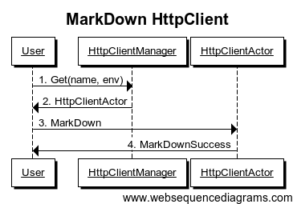
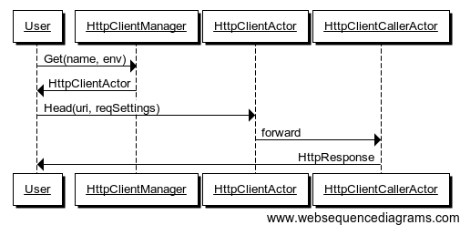
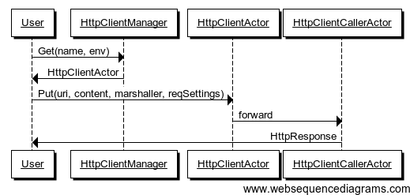

#Accessing Other Services using HTTP or HTTPS

##Overview

squbs HttpClient is the library enabling Scala/Akka/Spray applications to easily execute HTTP requests and asynchronously process the HTTP responses in a managed environment. This means it provides environment awareness whether you're in development or in production, service routing which exact service endpoint should be accessed, and also service resilience ensuring that service quality is being maintained. It is build on the top of Akka and the spray layer.

##Concepts

###HttpClient
The HttpClient is primary interface for the application to call a web site or service. For ease of use and manageability, the following facilities are provided with the HttpClient:

* json4s native/jackson Marshalling/Unmarshalling.
* Service resilience
* Per-client configuration to easy support spray related configuration, SslContext, circuit breaker configuration, pipeline and so on.
* HttpClient mark-up and mark-down.
* A HttpClientJMXBean to expose HttpClient/EndpointResolver/EnvironmentResolver/CircuitBreaker and mark-up/mark-down state information.

###EndpointResolver
The EndpointResolver is a resolver that maps a logical request to an endpoint which include host, port and context path. Generally, a service or web request on the internet does not be mapped. But a similar request inside an organization will need to be mapped based on a particular environment. For instance, a request to http://www.ebay.com/itm/0001 will be mapped to http://www.qa.ebay.com/itm/001 in the development and QA environments so as not to hit production data.

###EndpointRegistry
The EndpointRegistry is a registry keeping a sequence of resolvers and allowing resolvers to be registered at initialization time. This keeps the application code for resolution concise, easy to read, and easy to maintain. Resolvers will be tried one-by-one to map a request. This falls back to a default resolver that takes the request URL as is without modifications. 

###EnvironmentResolver
The EnvironmentResolver is a pluggable resolver that determines the environment of the endpoint to be called.

###EnvironmentRegistry
The EnvironmentRegistry keeps a sequence of EnvironmentResolvers, defaulting to a default resolver that does not resolve the environment allowing making straight calls.

###Pipeline
An infrastructure managing a sequence of pluggable handlers that would process requests/responses in sequence. From an HttpClient perspective, a request would be passed through the request pipeline which could in turn decorate the request or keep counters before sending the request out. In turn, the response also would be passed to the response pipeline to pre-process responses before handing the response to the application.

###Pipeline Handlers
Request/response handlers plugged into the pipeline. One example of a pipeline handler plugging into both the request and response pipeline is a tracing handler that adds a tracing request header to the request and reads the the tracing response header from the response. Assuming the endpoint also supports tracing, this would essentially allow service calls across multiple tiers to be stitched together for tracing and monitoring purposes.

Following are a few basic pipeline handlers provided with the HttpClient

* RequestCredentialsHandler
* RequestHeaderHandler (Add/Update/Delete)
* ResponseHeaderHandler (Add/Update/Delete)

## Getting Started

### Dependencies

Add the following dependency to your build.sbt or scala build file:

"org.squbs" %% "squbs-httpclient" % squbsVersion

### EndpointRegistry

Users could register multiple `EndpointResolver`s with the `EndpointRegistry` per actor system. The sequence of EndpointResolver to be tried is the reverse of the registration sequence. In other words, the last EndpointResolver registered has the highest priority and will be consulted first. If the endpoint cannot be resolved, the next to last EndpointResolve registered will be tried, in sequence. If the service name starts with "http://" or "https://" and is not resolved by any registered resolver, the service name itself will be used as the endpoint. This allows users to use a well known endpoint directly without any resolver registration, yet allows the resolver to make proper translations as needed.

The following is an example of an EndpointResolver:

**Scala**

```scala

object DummyLocalhostResolver extends EndpointResolver {
  override def resolve(svcName: String, env: Environment = Default): Option[Endpoint] = {
    if (svcName == null || svcName.length <= 0) throw new HttpClientException(700, "Service name cannot be null")
    env match {
      case Default | DEV => Some(Endpoint("http://localhost:8080/" + svcName))
      case _   => throw new HttpClientException(701, "DummyLocalhostResolver cannot support " + env + " environment")
    }
  }
  override def name: String = "DummyLocalhostResolver"
}

```

**Java**

```java

public class DummyLocalhostResolver extends AbstractEndpointResolver{
    @Override
    public String name() {
        return "DummyLocalhostResolver";
    }

    @Override
    public Option<Endpoint> resolve(String svcName, Environment env) {
        if (svcName == null || svcName.length() <= 0) throw new HttpClientException("Service name cannot be null");
        if(env == Default.value() || env == DEV.value()) return Option.apply(EndpointFactory.create("http://localhost:8080/" + svcName));
        else throw new HttpClientException("DummyLocalhostResolver cannot support " + env + " environment");
    }
}

```
After defining the resolver, simply register the resolver with the EndpointRegistry:

**Scala**

```scala

EndpointRegistry(actorSystem).register(DummyLocalhostResolver)

```
**Java**

```java

EndpointRegistryExtension registry = (EndpointRegistryExtension) EndpointRegistry.get(actorSystem); 
registry.register(new DummyLocalhostResolver());
        
```


### EnvironmentRegistry

The `EnvironmentRegistry` is used to resolve 'Default' environment to a particular environment such as 'Dev', 'QA' and 'Prod'. Users could register multiple EnvironmentResolvers. Similar to the EndpointResolver, The sequence of EnvironmentResolvers to be tried is the reverse of the registration sequence. If the environment cannot be resolved, it will fallback to 'Default'.

The following shows an example of an EnvironmentResolver:

**Scala**

```scala

object DummyPriorityEnvironmentResolver extends EnvironmentResolver {

  override def resolve(svcName: String): Environment = svcName match {
    case "abc" => QA
    case _ => Default
  }

  override def name: String = "DummyPriorityEnvironmentResolver"
}

``` 

**Java**

```java
public class DummyPriorityEnvironmentResolver implements EnvironmentResolver {
    @Override
    public String name() {
        return "DummyPriorityEnvironmentResolver";
    }

    @Override
    public Environment resolve(String svcName) {
        if("abc".equals(svcName)) return QA.value();
        else return Default.value();
    }
}

```

And here is how to register an EnvironmentResolver:

**Scala**

```scala

EnvironmentRegistry(actorSystem).register(DummyPriorityEnvironmentResolver)

```

**Java**

```java
EnvironmentRegistryExtension registry = (EnvironmentRegistryExtension)EnvironmentRegistry.get(actorSystem);
registry.register(new DummyPriorityEnvironmentResolver());

```

### Service Resilience

Service resilience layer has been supported in HttpClient which is build on top of akka circuit breaker to stop cascading failure, provide fallback logic and enable resilience.

### HttpClientPathBuilder

HttpClientPathBuilder is a trait used to generate uri path based on the path & param map, it will automatically handle encoding. Right now the param map only support the below value type:

* String
* Double
* Float
* Int
* Short
* Byte
* Char
* Boolean

### HttpClient Message Based API

#### Get HttpClient

```scala

val httpClientManager = HttpClientManager(system: ActorSystem).httpClientManager
httpClientManager ! Get(name: String, env: Environment = Default)

```
- name(Mandatory): Service Name
- env(Optional): Service Call Environment, by default is Default

response:
- Success: HttpClientActor Reference

Note: If httpClient is not exist, it will create a new one.


#### Delete HttpClient

```scala

val httpClientManager = HttpClientManager(system: ActorSystem).httpClientManager
httpClientManager ! Delete(name: String, env: Environment = Default)

```
- name(Mandatory): Service Name
- env(Optional): Service Call Environment, by default is Default

response:
- Success: DeleteSuccess
- Failure: HttpClientNotExistException


#### Delete All HttpClients

```scala

val httpClientManager = HttpClientManager(system: ActorSystem).httpClientManager
httpClientManager ! DeleteAll

```

response:
- Success: DeleteAllSuccess


#### Get All HttpClients

```scala

val httpClientManager = HttpClientManager(system: ActorSystem).httpClientManager
httpClientManager ! GetAll

```

response:
- Success: TrieMap[(String, Environment), HttpClient]


#### Update HttpClient Configuration

```scala

//get HttpClientActor Ref from Get HttpClient Message Call
httpClientActorRef ! UpdateConfig(config: Configuration)

```
- config: new Configuration

response:
- Success: HttpClientActor Reference


#### Update HttpClient Settings

```scala

//get HttpClientActor Ref from Get HttpClient Message Call
httpClientActorRef ! UpdateSettings(settings: Settings)

```
- settings: new Settings

response:
- Success: HttpClientActor Reference


#### Update HttpClient Pipeline

```scala

//get HttpClientActor Ref from Get HttpClient Message Call
httpClientActorRef ! UpdatePipeline(pipeline: Option[SimplePipelineConfig])

```
- pipeline: new Pipeline

response:
- Success: HttpClientActor Reference


#### MarkDown HttpClient

```scala

//get HttpClientActor Ref from Get HttpClient Message Call
httpClientActorRef ! MarkDown

```
response:
- Success: MarkDownSuccess



#### MarkUp HttpClient

```scala

//get HttpClientActor Ref from Get HttpClient Message Call
httpClientActorRef ! MarkUp

```
response:
- Success: MarkUpSuccess


#### Close HttpClient

```scala

//get HttpClientActor Ref from Get HttpClient Message Call
httpClientActorRef ! Close

```
response:
- Success: CloseSuccess


#### Use HttpClient Make HTTP Call

```scala

//get HttpClientActor Ref from Get HttpClient Message Call
httpClientActorRef ! Get(uri: String, reqSettings = Configuration.defaultRequestSettings)

```
- uri(Mandatory): Uri for Service Call
- reqSettings(Optional): Request Settings, default value is Configuration.defaultRequestSettings

response:
- Success: HttpResponse
- Failure: Throwable


```scala

//get HttpClientActor Ref from Get HttpClient Message Call
httpClientActorRef ! Head(uri: String, reqSettings = Configuration.defaultRequestSettings)

```
- uri(Mandatory): Uri for Service Call
- reqSettings(Optional): Request Settings, default value is Configuration.defaultRequestSettings

response:
- Success: HttpResponse
- Failure: Throwable



```scala

//get HttpClientActor Ref from Get HttpClient Message Call
httpClientActorRef ! Options(uri: String, reqSettings = Configuration.defaultRequestSettings)

```
- uri(Mandatory): Uri for Service Call
- reqSettings(Optional): Request Settings, default value is Configuration.defaultRequestSettings

response:
- Success: HttpResponse
- Failure: Throwable


```scala

//get HttpClientActor Ref from Get HttpClient Message Call
httpClientActorRef ! Delete(uri: String, reqSettings = Configuration.defaultRequestSettings)

```
- uri(Mandatory): Uri for Service Call
- reqSettings(Optional): Request Settings, default value is Configuration.defaultRequestSettings

response:
- Success: HttpResponse
- Failure: Throwable


```scala

//get HttpClientActor Ref from Get HttpClient Message Call
httpClientActorRef ! Put[T](uri: String, content: Option[T], marshaller: Marshaller[T] = Json4sJacksonNoTypeHintsProtocol.json4sMarshaller, reqSettings: RequestSettings = Configuration.defaultRequestSettings)

```
- uri(Mandatory): Uri for Service Call
- content(Mandatory): Put Content
- marshaller(Optional): By Default is org.squbs.httpclient.json.Json4sJacksonNoTypeHintsProtocol.json4sMarshaller
- reqSettings(Optional): Request Settings, default value is Configuration.defaultRequestSettings

response:
- Success: HttpResponse
- Failure: Throwable



```scala

//get HttpClientActor Ref from Get HttpClient Message Call
httpClientActorRef ! Post[T](uri: String, content: Option[T], marshaller: Marshaller[T] = Json4sJacksonNoTypeHintsProtocol.json4sMarshaller, reqSettings: RequestSettings = Configuration.defaultRequestSettings)

```
- uri(Mandatory): Uri for Service Call
- content(Mandatory): Post Content
- marshaller(Optional): By Default is org.squbs.httpclient.json.Json4sJacksonNoTypeHintsProtocol.json4sMarshaller
- reqSettings(Optional): Request Settings, default value is Configuration.defaultRequestSettings

response:
- Success: HttpResponse
- Failure: Throwable


#### Use HttpClient Make HTTP Call and return Unmarshall Object

```scala

//get httpResponse from the above Http Call
import org.squbs.httpclient.pipeline.HttpClientUnmarshal._
val result: Try[T] = httpResponse.unmarshalTo[T] //T is the unmarshall object

```

### HttpClient API

#### Get HttpClient

**Scala**

```scala

val client: HttpClient = HttpClientFactory.get(name: String, env: Environment = Default)

```
- name(Mandatory): Service Name
- env(Optional): Service Call Environment, by default is Default

Note: If httpClient is not exist, it will create a new one.

**Java**

Please use HttpClientFactory in japi package.

#### Update

Update Configuration:

```scala

val client: HttpClient = HttpClientFactory.get(name: String, env: Environment = Default).withConfig(config: Configuration)

```

Update Settings:

```scala

val client: HttpClient = HttpClientFactory.get(name: String, env: Environment = Default).withSettings(config: Settings)

```

Update Pipeline:

```scala

val client: HttpClient = HttpClientFactory.get(name: String, env: Environment = Default).withPipeline(pipeline: Option[SimplePipelineConfig])

```

#### MarkDown

```scala

val status: Future[MarkDownSuccess.type] = client.markDown

```

#### MarkUp

```scala

val status: Future[MarkUpSuccess.type] = client.markUp

```

#### readyFuture

```scala

val result: Future[Unit] = client.readyFuture

```

#### Use HttpClient to make HTTP Call

```scala

val t: Future[T] = client.get[T](uri: String, reqSettings: RequestSettings = Configuration.defaultRequestSettings)
val response: Future[HttpResponse] = client.raw.get(uri: String, reqSettings: RequestSettings = Configuration.defaultRequestSettings)

```
- uri(Mandatory): Uri for Service Call
- reqSettings(Optional): Request Settings, default value is Configuration.defaultRequestSettings  

```scala

val t: Future[T] = client.post[T](uri: String, content: Option[T], reqSettings: RequestSettings = Configuration.defaultRequestSettings)
val response: Future[HttpResponse] = client.raw.post(uri: String, content: Option[T], reqSettings: RequestSettings = Configuration.defaultRequestSettings)

```
- uri(Mandatory): Uri for Service Call
- content(Mandatory): Post Content
- reqSettings(Optional): Request Settings, default value is Configuration.defaultRequestSettings 

```scala

val t: Future[T] = client.put[T](uri: String, content: Option[T], reqSettings: RequestSettings = Configuration.defaultRequestSettings)
val response: Future[HttpResponse] = client.raw.put(uri: String, content: Option[T], reqSettings: RequestSettings = Configuration.defaultRequestSettings)

```
- uri(Mandatory): Uri for Service Call
- content(Mandatory): Put Content
- reqSettings(Optional): Request Settings, default value is Configuration.defaultRequestSettings 

```scala

val t: Future[T] = client.head[T](uri: String, reqSettings: RequestSettings = Configuration.defaultRequestSettings)
val response: Future[HttpResponse] = client.raw.head(uri: String, reqSettings: RequestSettings = Configuration.defaultRequestSettings)

```
- uri(Mandatory): Uri for Service Call
- reqSettings(Optional): Request Settings, default value is Configuration.defaultRequestSettings

```scala

val t: Future[T] = client.delete[T](uri: String, reqSettings: RequestSettings = Configuration.defaultRequestSettings)
val response: Future[HttpResponse] = client.raw.delete(uri: String, reqSettings: RequestSettings = Configuration.defaultRequestSettings)

```
- uri(Mandatory): Uri for Service Call
- reqSettings(Optional): Request Settings, default value is Configuration.defaultRequestSettings

```scala

val t: Future[T] = client.options[T](uri: String, reqSettings: RequestSettings = Configuration.defaultRequestSettings)
val response: Future[HttpResponse] = client.raw.options(uri: String, reqSettings: RequestSettings = Configuration.defaultRequestSettings)

```
- uri(Mandatory): Uri for Service Call
- reqSettings(Optional): Request Settings, default value is Configuration.defaultRequestSettings


### Pipeline

The pipeline is a way for pre-processing the request as well as post-processing the response. The user can provide a request/response pipeline when calling service as follows:
 
```scala

object DummyRequestResponsePipeline extends SimplePipelineConfig(
  Seq(new RequestAddHeaderHandler(RawHeader("req2-name", "req2-value"))),
  Seq(new ResponseAddHeaderHandler(RawHeader("res2-name", "res2-value")))
)

```

By default, squbs HttpClient provides the below Request/Response Handlers.
- RequestCredentialsHandler (HttpCredentials Related)
- RequestAddHeaderHandler (Add Header in Request Phase)
- RequestRemoveHeaderHandler (Remove Header in Request Phase)
- RequestUpdateHeaderHandler (Update Header in Request Phase)
- ResponseAddHeaderHandler (Add Header in Response Phase)
- ResponseRemoveHeaderHandler (Remove Header in Response Phase)
- ResponseUpdateHeaderHandler (Update Header in Response Phase)

### Configuration

Configuration provides spray host related settings, sslContext settings, circuit breaker settings and pipeline.

Configuration
- Settings 
  hostSettings (default is Configuration.defaultHostSettings)
  connectionType (default is ClientConnectionType.AutoProxied)
  sslContext (default is None)
  circuitBreakerConfig (default is Configuration.defaultCircuitBreakerConfig)
- pipeline (default is None)

### Json4s Marshalling/Unmarshalling

Squbs HttpClient provides integration with Json4s Marshalling/Unmarshalling to support native/jackson Protocols. User don't limit to use Json4s for Marshalling/Unmarshalling.

Json4s Jackson Support:

- Json4sJacksonNoTypeHintsProtocol (NoTypeHints, user only need to import this object)
- Json4sJacksonShortTypeHintsProtocol (ShortTypeHints, user need to implement the trait)
- Json4sJacksonFullTypeHintsProtocol (FullTypeHints, user need to implement the trait)
- Json4sJacksonCustomProtocol (Customized, user need to implement the trait)

Json4s Native Support:

- Json4sNativeNoTypeHintsProtocol (NoTypeHints, user only need to import this object)
- Json4sNativeShortTypeHintsProtocol (ShortTypeHints, user need to implement the trait)
- Json4sNativeFullTypeHintsProtocol (FullTypeHints, user need to implement the trait)
- Json4sNativeCustomProtocol (Customized, user need to implement the trait)

### Jackson Marshalling/Unmarshalling

Squbs HttpClient provides JacksonProtocol to support Java Bean Marshalling/Unmarshalling, in case the payload is not a case class.


### HttpClientJMXBean

HttpClientInfo:
- name
- env
- endpoint
- status
- connectionType
- maxConnections
- maxRetries
- maxRedirects
- requestTimeout
- connectingTimeout
- requestPipelines
- responsePipelines

```scala

val httpClients: java.util.List[HttpClientInfo] = (new HttpClientBean(actorSystem)).getHttpClientInfo

```

EndpointresolverInfo:
- position
- resolver

```scala

val endpointResolvers: java.util.List[EndpointResolverInfo] = (new EndpointResolverBean(actorSystem)).getHttpClientEndpointResolverInfo

```

EnvironmentResolverInfo:
- position
- resolver

```scala

val environmentResolvers: java.util.List[EnvironmentResolverInfo] = (new EnvironmentResolverBean(actorSystem)).getHttpClientEnvironmentResolverInfo

```

CircuitBreakerInfo:
- name
- status
- lastDurationConfig
- successTimes
- fallbackTimes
- failFastTimes
- exceptionTimes
- lastDurationErrorRate
- lastDurationFailFastRate
- lastDuratoinExceptionRate

```scala

val circuitBreakers: java.util.List[CircuitBreakerInfo] = (new CircuitBreakerBean(actorSystem)).getHttpClientCircuitBreakerInfo

```

### Google API Sample

#### Provide Endpoint Resolver for google api

```scala

object GoogleMapAPIEndpointResolver extends EndpointResolver {
  override def resolve(svcName: String, env: Environment = Default): Option[Endpoint] = {
    if (svcName == name)
      Some(Endpoint("http://maps.googleapis.com/maps"))
    else
      None
  }

  override def name: String = "googlemap"
}

```

#### Provide case class for google api unmarshal

```scala

case class Elevation(location: Location, elevation: Double)
case class Location(lat: Double, lng: Double)
case class GoogleApiResult[T](status: String, results: List[T])

```

#### Main

```scala

object HttpClientDemo1 extends App {

  implicit val system = ActorSystem("HttpClientDemo1")
  implicit val timeout: Timeout = 3 seconds
  import system.dispatcher
  EndpointRegistry(system).register(GoogleMapAPIEndpointResolver)

  val response = HttpClientFactory.get("googlemap").raw.get("/api/elevation/json?locations=27.988056,86.925278&sensor=false")
  response onComplete {
    case Success(res@HttpResponse(StatusCodes.OK, _, _, _)) =>
      println("Success, response entity is: " + res.entity.asString)
      system.shutdown
    case Success(res@HttpResponse(code, _, _, _)) =>
      println("Success, the status code is: " + code)
      system.shutdown
    case Failure(e) =>
      println("Failure, the reason is: " + e.getMessage)
      system.shutdown
  }
}

```

#### Main (unmarshal api)

```scala

object HttpClientDemo2 extends App {

  implicit val system = ActorSystem("HttpClientDemo2")
  implicit val timeout: Timeout = 3 seconds
  import system.dispatcher
  EndpointRegistry(system).register(GoogleMapAPIEndpointResolver)
  import org.squbs.httpclient.json.Json4sJacksonNoTypeHintsProtocol._
  val response = HttpClientFactory.get("googlemap").get[GoogleApiResult[Elevation]]("/api/elevation/json?locations=27.988056,86.925278&sensor=false")
  response onComplete {
    case Success(data: GoogleApiResult[Elevation]) =>
      println("Success, elevation is: " + data.results.head.elevation)
      system.shutdown
    case Failure(e) =>
      println("Failure, the reason is: " + e.getMessage)
      system.shutdown
  }
}

```

#### Main (Message Based API)

```scala

object HttpClientDemo2 extends App {

  implicit val system = ActorSystem("HttpClientDemo2")
  implicit val timeout: Timeout = 3 seconds

  EndpointRegistry(system).register(GoogleMapAPIEndpointResolver)

  system.actorOf(Props(new HttpClientDemoActor(system))) ! GoogleApiCall
}

case class HttpClientDemoActor(system: ActorSystem) extends Actor with HttpClientTestKit {
  override def receive: Receive = {
    case GoogleApiCall =>
      val httpClientManager = HttpClientManager(system).httpClientManager
      httpClientManager ! HttpClientManagerMessage.Get("googlemap")
    case httpClientActorRef: ActorRef =>
      httpClientActorRef ! HttpClientActorMessage.Get("api/elevation/json?locations=27.988056,86.925278&sensor=false")
    case res@ HttpResponse(StatusCodes.OK, _, _, _) =>
      println("Success, response entity is: " + res.entity.asString)
      import HttpClientUnmarshal._
      import org.squbs.httpclient.json.Json4sJacksonNoTypeHintsProtocol._
      val unmarshalData = res.unmarshalTo[GoogleApiResult[Elevation]]
      unmarshalData match {
        case Success(data) =>
          println("elevation is: " + data.results.head.elevation + ", location.lat is: " + data.results.head.location.lat)
        case Failure(e)     =>
          println("unmarshal error is:" + e.getMessage)
      }
      system.shutdown
    case HttpResponse(code, _, _, _) =>
      println("Success, the status code is: " + code)
      system.shutdown
    case akka.actor.Status.Failure(e) =>
      println("Failure, the reason is: " + e.getMessage)
      system.shutdown
  }
}

case object GoogleApiCall

```

### HttpClient Configuration Override

Configuration Override Sequence:

RequestSettings > withConfig API > Endpoint Configuration in EndpointResolver > Spray Configuration override in application.conf > reference.conf in spray-can jar

RequestSettings could provide request timeout and HttpHeaders in request pipeline to override.
```scala
val httpClient: HttpClient = HttpClientFactory.get(name: String)
val futureT: Future[T] = httpClient.get[T](uri: String, reqSettings: RequestSettings)

```

withConfig/UpdateConfig API could provide HttpClient Configuration override.
```scala
val httpClient: HttpClient = HttpClientFactory.get(name: String).withConfig(config: Configuration)

```

Endpoint Configuration in EndpointResolver
```scala
object XXXEndpointResolver extends EndpointResolver {
    override def resolve(svcName: String, env: Environment = Default): Option[Endpoint] = {
      if (svcName == name)
        Some(Endpoint(uri: String, config: Configuration))
      else
        None
    }

    override def name: String = "xxx"
  }
```

Spray Configuration override in application.conf

```
spray.can.client {
  request-timeout = 20 s
}
```

Spray default request-timeout is 20s, connection-timeout is 10s, please refer reference.conf in spray-can jar
