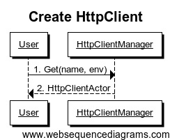
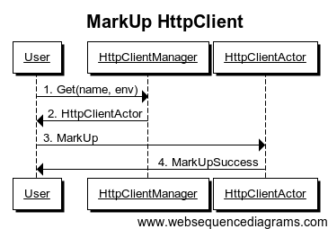

## Overview

Squbs Http Client is the library to allow scala applications to easily execute HTTP requests and asynchronously process the HTTP responses. It build on the top of spray client layer.

## Features
Squbs Http Client provides the following additional features on top of spray client layer:

1. Provide EndpointResolver to generate different endpoint base on service name & env.
2. Provide EndpointRegistry to support multiple EndpointResolver to resolve endpoint for service.
3. Provide EnvironmentResolver to resolve Default environment base on service name.
4. Provide EnvironmentRegistry to support multiple EnvironmentResolver to resolve Default environment 
3. Provide Pipeline to execute request/response pipeline.
4. Provide Configuration to easy support spray related configuration, sslContext and so on.
5. Provide HttpClientJMXBean to expose HttpClient/EndpointResolver/EnvironmentResolver Information.
6. Provide json4s native/jackson Marshalling/Unmarshalling.
7. Provide markup/markdown feature for HttpClient
8. Provide some basic pipeline handlers.	
   - RequestCredentialsHandler
   - RequestHeaderHandler
   - ResponseHeaderHandler
9. Provide Java API/Message Based API to support HTTP GET/POST/PUT/HEAD/OPTIONS/DELETE calls.

## How to Use

### Dependencies

Add below dependencies on your build.sbt or related scala build file

"org.squbs" %% "httpclient" % squbsVersion

### EndpointRegistry

EndpointRegistry is used to generate different endpoint base on service name & env. User could registry multiple EndpointResolver, it based on the sequence when user registry their EndpointResolver, the latter one will take the priority if it could resolved. If it cannot resolve, but the service name is start with "http://" or "https://", it will fallback to the svcName as the endpoint, this is simple to use base on the third party service endpoint no matter what kind of env, it will return the same endpoint.

```java

object DummyLocalhostResolver extends EndpointResolver {
  override def resolve(svcName: String, env: Environment = Default): Option[Endpoint] = {
    if (svcName == null && svcName.length <= 0) throw new HttpClientException(700, "Service name cannot be null")
    env match {
      case Default | DEV => Some(Endpoint("http://localhost:8080/" + svcName))
      case _   => throw new HttpClientException(701, "DummyLocalhostResolver cannot support " + env + " environment")
    }
  }

  override def name: String = "DummyLocalhostResolver"
}

``` 

```java

EndpointRegistry.register(DummyLocalhostResolver)

```

### EnvironmentRegistry

EnvironmentRegistry is used to resolve 'Default' environment to particular environment such as 'Dev', 'QA' and 'Prod'. User could registry multiple EnvironmentResolver, it based on the sequence when user registry their EnvironmentResolver, the latter one will take the priority if it could resolved. If it cannot resolve, it will fallback to 'Default'.

```java

object DummyPriorityEnvironmentResolver extends EnvironmentResolver {

  override def resolve(svcName: String): Option[Environment] = svcName match {
    case "abc" => Some(QA)
    case _ => None
  }

  override def name: String = "DummyPriorityEnvironmentResolver"
}

``` 

```java

EnvironmentRegistry.register(DummyPriorityEnvironmentResolver)

```

### HttpClient Message Based API

#### Create HttpClient

```java
val httpClientManager = HttpClientManager(system: ActorSystem).httpClientManager
httpClientManager ! Create(name: String, env: Environment = Default, pipeline: Option[Pipeline] = None)
```
- name(Mandatory): Service Name
- env(Optional): Service Call Environment, by default is Default
- pipeline(Optional): Service Call Request/Response Pipeline

response:
-Success: HttpClientActor Reference
-Failure: HttpClientExistException


#### Get HttpClient

```java
val httpClientManager = HttpClientManager(system: ActorSystem).httpClientManager
httpClientManager ! Get(name: String, env: Environment = Default)
```
- name(Mandatory): Service Name
- env(Optional): Service Call Environment, by default is Default

response:
-Success: HttpClientActor Reference
-Failure: HttpClientNotExistException



#### Delete HttpClient

```java
val httpClientManager = HttpClientManager(system: ActorSystem).httpClientManager
httpClientManager ! Delete(name: String, env: Environment = Default)
```
- name(Mandatory): Service Name
- env(Optional): Service Call Environment, by default is Default

response:
-Success: DeleteSuccess
-Failure: HttpClientNotExistException


#### Delete All HttpClients

```java
val httpClientManager = HttpClientManager(system: ActorSystem).httpClientManager
httpClientManager ! DeleteAll
```

response:
-Success: DeleteAllSuccess


#### Get All HttpClients

```java
val httpClientManager = HttpClientManager(system: ActorSystem).httpClientManager
httpClientManager ! GetAll
```

response:
-Success: TrieMap[(String, Environment), (Client, ActorRef)]


#### Update HttpClient Configuration

```java
//get HttpClientActor Ref from Create/Get HttpClient Message Call
httpClientActorRef ! Update(config: Configuration)
```
- config(Mandatory): new Configuration

response:
-Success: UpdateSuccess


#### MarkDown HttpClient

```java
//get HttpClientActor Ref from Create/Get HttpClient Message Call
httpClientActorRef ! MarkDown
```
response:
-Success: MarkDownSuccess


#### MarkUp HttpClient

```java
//get HttpClientActor Ref from Create/Get HttpClient Message Call
httpClientActorRef ! MarkUp
```
response:
-Success: MarkUpSuccess



#### Close HttpClient

```java
//get HttpClientActor Ref from Create/Get HttpClient Message Call
httpClientActorRef ! Close
```
response:
-Success: CloseSuccess


#### Use HttpClient Make HTTP Call

```java
//get HttpClientActor Ref from Create/Get HttpClient Message Call
httpClientActorRef ! Get(uri)
```
- uri(Mandatory): Uri for Service Call

response:
-Success: HttpResponseWrapper(status: StatusCode, content: Right[HttpResponse])
-Failure: HttpResponseWrapper(status: StatusCode, content: Left[Throwable])


```java
//get HttpClientActor Ref from Create/Get HttpClient Message Call
httpClientActorRef ! Head(uri)
```
- uri(Mandatory): Uri for Service Call

response:
-Success: HttpResponseWrapper(status: StatusCode, content: Right[HttpResponse])
-Failure: HttpResponseWrapper(status: StatusCode, content: Left[Throwable])


```java
//get HttpClientActor Ref from Create/Get HttpClient Message Call
httpClientActorRef ! Options(uri)
```
- uri(Mandatory): Uri for Service Call

response:
-Success: HttpResponseWrapper(status: StatusCode, content: Right[HttpResponse])
-Failure: HttpResponseWrapper(status: StatusCode, content: Left[Throwable])


```java
//get HttpClientActor Ref from Create/Get HttpClient Message Call
httpClientActorRef ! Delete(uri)
```
- uri(Mandatory): Uri for Service Call

response:
-Success: HttpResponseWrapper(status: StatusCode, content: Right[HttpResponse])
-Failure: HttpResponseWrapper(status: StatusCode, content: Left[Throwable])


```java
//get HttpClientActor Ref from Create/Get HttpClient Message Call
httpClientActorRef ! Put[T](uri: String, content: Some[T], json4sSupport: BaseJson4sSupport = org.squbs.httpclient.json.Json4sJacksonNoTypeHintsProtocol)
```
- uri(Mandatory): Uri for Service Call
- content(Mandatory): Put Content
- json4sSupport(Optional): By Default is org.squbs.httpclient.json.Json4sJacksonNoTypeHintsProtocol

response:
-Success: HttpResponseWrapper(status: StatusCode, content: Right[HttpResponse])
-Failure: HttpResponseWrapper(status: StatusCode, content: Left[Throwable])


```java
//get HttpClientActor Ref from Create/Get HttpClient Message Call
httpClientActorRef ! Post[T](uri: String, content: Some[T], json4sSupport: BaseJson4sSupport = org.squbs.httpclient.json.Json4sJacksonNoTypeHintsProtocol)
```
- uri(Mandatory): Uri for Service Call
- content(Mandatory): Post Content
- json4sSupport(Optional): By Default is org.squbs.httpclient.json.Json4sJacksonNoTypeHintsProtocol

response:
-Success: HttpResponseWrapper(status: StatusCode, content: Right[HttpResponse])
-Failure: HttpResponseWrapper(status: StatusCode, content: Left[Throwable])


#### Use HttpClient Make HTTP Call and return Unmarshall Object

```java
//get httpResponse from the above Http Call
import org.squbs.httpclient.HttpClientManager._
val result: T = httpResponse.unmarshalTo[T] //T is the unmarshall object
```

### HttpClient API

#### Get Or Create HttpClient

```java
val client: HttpClient = HttpClientFactory.getOrCreate(name: String, env: Environment = Default, pipeline: Option[Pipeline] = None)
```
- name(Mandatory): Service Name
- env(Optional): Service Call Environment, by default is Default
- pipeline(Optional): Service Call Request/Response Pipeline

#### Update

Update Configuration:

```java
val client: HttpClient = HttpClientFactory.getOrCreate(name: String, env: Environment = Default, pipeline: Option[Pipeline] = None).withConfig(config: Configuration)
val response: Future[HttpResponseWrapper] = client.get(uri: String)
```

#### MarkDown

```java
client.markDown
```

#### MarkUp

```java
client.markUp
```

#### Use HttpClient Make HTTP Call

```java
val response: Future[HttpResponseWrapper] = client.get(uri: String)
```
- uri(Mandatory): Uri for Service Call

```java
val response: Future[HttpResponseWrapper] = client.post[T](uri: String, content: Some[T])
```
- uri(Mandatory): Uri for Service Call
- content(Mandatory): Post Content

```java
val response: Future[HttpResponseWrapper] = client.put[T](uri: String, content: Some[T])
```
- uri(Mandatory): Uri for Service Call
- content(Mandatory): Put Content

```java
val response: Future[HttpResponseWrapper] = client.head(uri: String)
```
- uri(Mandatory): Uri for Service Call

```java
val response: Future[HttpResponseWrapper] = client.delete(uri: String)
```
- uri(Mandatory): Uri for Service Call

```java
val response: Future[HttpResponseWrapper] = client.options(uri: String)
```
- uri(Mandatory): Uri for Service Call

#### Use HttpClient Make HTTP Call and return Unmarshall Object

User need to implement the Json Serialize/Deserialize Protocol, please see [json4s Marshalling/Unmarshalling](#json4s-marshallingunmarshalling).

```java
val response: Future[HttpResponseEntityWrapper[R]] = client.getEntity[R](uri: String)
```
- uri(Mandatory): Uri for Service Call
- R(Mandatory): Unmarshall Object

```java
val response: Future[HttpResponseEntityWrapper[R]] = client.postEntity[T, R](uri: String, content: Some[T])
```
- uri(Mandatory): Uri for Service Call
- T(Mandatory): Post Content
- R(Mandatory): Unmarshall Object

```java
val response: Future[HttpResponseEntityWrapper[R]] = client.putEntity[T, R](uri: String, content: Some[T])
```
- uri(Mandatory): Uri for Service Call
- T(Mandatory): Put Content
- R(Mandatory): Unmarshall Object

```java
val response: Future[HttpResponseEntityWrapper[R]] = client.headEntity[R](uri: String)
```
- uri(Mandatory): Uri for Service Call
- R(Mandatory): Unmarshall Object

```java
val response: Future[HttpResponseEntityWrapper[R]] = client.deleteEntity[R](uri: String)
```
- uri(Mandatory): Uri for Service Call
- R(Mandatory): Unmarshall Object

```java
val response: Future[HttpResponseEntityWrapper[R]] = client.optionsEntity[R](uri: String)
```
- uri(Mandatory): Uri for Service Call
- R(Mandatory): Unmarshall Object


### Pipeline

Pipeline provide a way for user to provide request/response pipeline when calling service.
 
```java
object DummyRequestResponsePipeline extends Pipeline {
  override def requestPipelines: Seq[RequestTransformer] = Seq[RequestTransformer](RequestAddHeaderHandler(RawHeader("req2-name", "req2-value")).processRequest)
  override def responsePipelines: Seq[ResponseTransformer] = Seq[ResponseTransformer](ResponseAddHeaderHandler(RawHeader("res2-name", "res2-value")).processResponse)
}
```

By default, squbs Http Client provide the below Request/Response Handlers.
- RequestCredentialsHandler (HttpCredentials Related)
- RequestAddHeaderHandler (Add Header in Request Phase)
- RequestRemoveHeaderHandler (Remove Header in Request Phase)
- RequestUpdateHeaderHandler (Update Header in Request Phase)
- ResponseAddHeaderHandler (Add Header in Response Phase)
- ResponseRemoveHeaderHandler (Remove Header in Response Phase)
- ResponseUpdateHeaderHandler (Update Header in Response Phase)

### Configuration

Configuration provides spray host related configuration and sslContext configuration.

Configuration
- hostSettings (default is Configuration.defaultHostSettings)
- connectionType (default is ClientConnectionType.AutoProxied)
- sslContext (default is None)

### Json4s Marshalling/Unmarshalling

Squbs Http Client provide integration with Json4s Marshalling/Unmarshalling to support native/jackson Protocols.

Json4s Jackson Support:

- Json4sJacksonNoTypeHintsProtocol (NoTypeHints, user only need to import this object)
- Json4sJacksonShortTypeHintsProtocol (ShortTypeHints, user need to implement the trait)
- Json4sJacksonFullTypeHintsProtocol (FullTypeHints, user need to implement the trait)
- Json4sJacksonCustomProtocol (Customized, user need to implement the trait)

Json4s Native Support:

- Json4sNativeNoTypeHintsProtocol (NoTypeHints, user only need to import this object)
- Json4sNativeShortTypeHintsProtocol (ShortTypeHints, user need to implement the trait)
- Json4sNativeFullTypeHintsProtocol (FullTypeHints, user need to implement the trait)
- Json4sNativeCustomProtocol (Customized, user need to implement the trait)

### HttpClientJMXBean

HttpClientInfoMXBean:
- name
- env
- endpoint
- status
- connectionType
- maxConnections
- maxRetries
- maxRedirects
- requestTimeout
- connectingTimeout
- requestPipelines
- responsePipelines

```java
val httpClients: java.util.List[HttpClientInfo] = HttpClientBean.getHttpClientInfo
```

EndpointresolverMXBean:
- position
- resolver

```java
val endpointResolvers: java.util.List[EndpointResolverInfo] = EndpointResolverBean.getHttpClientEndpointResolverInfo
```

EnvironmentResolverBean:
- position
- resolver

```java
val environmentResolvers: java.util.List[EnvironmentResolverInfo] = EnvironmentResolverBean.getHttpClientEnvironmentResolverInfo
```