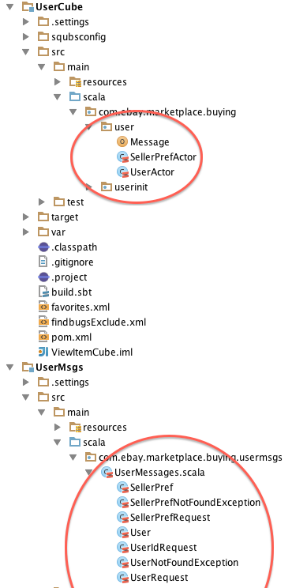

#Messages

Akka actors communicate via immutable messages. These can be defined anywhere in code. As squbs deals with messages communicated across cubes, such messages will have to be defined in a message project (or jar) that is a dependency of both the sender and receiver of these messages. These message projects commonly have a single file in a single package. Alternatively, the messages can also be mapped to the receivers' packages.

Messages must be defined as immutable case classes (don't use vars in your case class definitions) or case objects. Messages are generally very simple and does not contain logic. Multiple message case classes or case objects are declared in a particular Scala file totally separate from cube logic.

Messages used for communicating between cubes should be separated in different jars and projects. Message jars and/or projects should not have other dependencies. Ideally, they are all self-contained. Senders and/or receivers of such messages should not be subject to additional dependencies introduced by messages. The project hierarchy below with actors and messages circled in red show clear project separations between cubes and messages.



##Constructing messages

Following the case class and case object pattern, construction of the messages are very straightforward and do not need an explicit call into the constructor. Case classes implicitly generate an associated factory object with proper apply and unapply methods allowing them to be pattern-matched very easily.

When integrating messages with database objects or other dependent infrastructure, it is common to provide message construction directly from these classes. Yet, we MUST NOT declare associate factory objects to provide apply method to construct messages from the database object. Doing so would subject the message jar to dependencies on such database infrastructure. All other cubes using the message will consequently be subject to such database infrastructure dependencies.

A common pattern being used for message construction is to provide a "Message" object **inside the cube** for package using such database (or other) infrastructure. This Message object provides a set of apply methods that the actors will use to construct the message, for instance from mutable data objects. The message type created depends directly on the data object provided as input. Following is an example of such a `Message` object.

```
object Message {
  def apply(c: CountryDO) = Country(c.getCountryId, c.getCountryCode, c.hasB2BVat)
  def apply(p: SiteParamDO) = SiteParameter(p.getParamName, p.getParamType, p.getSiteId, p.getParamValue)
  def apply(doi: SaleThemeLayoutDO) = SaleThemeLayout(doi.getTemplateId, doi.getXmlText)
}
```

The actor creating this object need not be concerned about the exact type. This is encoded in the `Message` object itself. To construct a message from such an object, the caller just needs to call

```
  targetActorRef ! Message(myDBObject)
```

This way the construction of messages which is dependent on the infrastructure will be contained in the cube producing such messages. Such dependencies won't leak to consumers of the message.

##Dealing with Large, Complex Messages

In some instances, especially with data objects, these objects have a class hierarchy and heavyweight constructors that could not easily be done with a simple case class. The number of fields can be far beyond what is possible in case classes making it unappealing to do field pattern matching. Complex messages such as purchase orders, invoices commonly fall into this category.

The strategy to deal with such complex objects is to provide the message as traits declaring all fields. These traits **do not have dependencies** and **reside in the message project**. If there is a class hierarchy, subtypes should also be represented as traits extending from proper super type. This is done in the message project or jar. The following examples show such traits.

```
trait Sale {

  val item : Item
  val siteId : Int
  val sellerId : Long
  val saleType: SaleTypeEnum
  val salePrice : Option[Money]
  
  // Many, many more fields taken out to keep some sanity...
  
  val isTaxNull: Boolean

  // Derived fields have to be lazy.
  lazy val hasValueAddedTax: Boolean = !isTaxNull
}
```

```  
trait Auction extends Sale {

  override val salePrice : Option[Money] = currentPrice match {
    case Some(y) if y.isPositive => Some(y)
    case _ => startPrice
  }

  val isReserveMet : Boolean = (currentPrice, reservePrice) match {
    case (Some(x),Some(y)) => x.compareTo(y) >= 0
    case _ => false
  }

  // Derived fields need to be lazy.
  lazy val isReserve : Boolean = reservePrice exists (_.isPositive)

  lazy val isListedAsBIN : Boolean = binPrice exists (_.isPositive)


  lazy val isOfferExists : Boolean = offerCount > 0
  
  // And again, many more...
}
  
```

The Message object in the originating cube will commonly declare the concrete (or abstract) implementation of these messages with proper constructors from the mutable data objects. It is important to ensure the concrete or abstract implementation provides no functionality and should not declare additional fields except private ones to support the construction. In essence, it only implements the constructors to create the object extending the trait.

If fields defined in the trait or any extending trait derives its value from other fields that are set in the constructor implementation, these fields need to be marked as lazy to avoid NullPointerExceptions during initialization. This is because the trait will try to initialize all the fields at construction. The derived fields would reference not-yet set fields to be set in the constructor. Lazy initialization causes these fields to reference the other fields on first use, which is normally far after the construction of the object. Following examples show the concrete implementation, constructor, and apply methods for those traits. This code is in the cube project, not in the message project. Note: Even the implementation is immutable.

```
  private abstract class SaleMessage(saleDO: SaleDO) extends Sale {
    import saleDO._
    val item : Item= Message(getItem)
    val siteId : Int= getSiteId
    val sellerId : Long = getSellerId
    val saleType: SaleTypeEnum = SaleTypeEnum.map.get(getSaleType).getOrElse(SaleTypeEnum.INVALID)
    val salePrice : Option[Money] = currentPrice
    
    // Again, many more…
    
    private val optionTax = Option(Double.unbox(saleDO.getTaxNew)) 
    val isTaxNull: Boolean = optionTax == None
  }
```

```
  private class AuctionMessage(auction: AuctionDO) extends SaleMessage(auction) with Auction {
    override val reservePrice: Option[Money]  = auction.getReservePrice
    override val binPrice : Option[Money] = auction.getBinPrice
  }

```

Now this would be the `Message.apply()`  method in charge of constructing these. This example below show other similar types of sales that are not addressed in the examples above:

```
object Message {

  def apply(sale: SaleDO): Sale =
    sale match {
      case s: FixedPriceDO => new SaleMessage(s) with FixedPrice
      case s: ChineseAuctionDO => new AuctionMessage(s) with ChineseAuction
      case s: DutchAuctionDO => new AuctionMessage(s) with DutchAuction
      case s: AuctionDO => new AuctionMessage(s)
      case s => throw new IllegalArgumentException(s.getClass.getName + " not a recognized sale type")
    }
```

By following this pattern, messages stay immutable and the message project would not add any dependencies on database or other infrastructure that can be propagated to the message consumer's dependency chain.

###Consumer View of Messages as Traits

For the consumers (cubes only receiving) of messages that are represented as traits in the message project, the type they are dealing with are just the trait types. In this case `Sale` and `Auction`. So the receive block receiving such types cannot reference the concrete types `SaleMessage` or `AuctionMessage`. In essence, these receiving actors won't even have these concrete types in their dependency and referencing them would yield a compile error. Below is an example of a receive block:

```
def receive = {
  case auction: Auction => println(s"Item: ${auction.item}, Reserve met: ${auction.isReserveMet}")
  case sale: Sale =>       println(s"Item: ${sale.item}")
  
  // Auction is a subtype of Sale and therefore will need to be matched first.
  // If sale is first both Auction and Sale type will match the first 
  // Sale type match.
}

``` 


