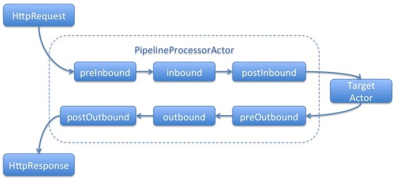
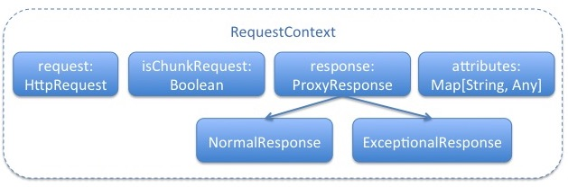

#Request/Response Pipeline Proxy

### Overview
Sometimes, we may have common biz logic across different squbs-services.
For example: CAL, Authentication/Authorization, tracking, cookie management, A/B testing, etc.

Usually we don't want the service owner to take care of these common stuffs in their Actor/Router.
That's why we introduce the squbs proxy to facilitate it.

Generally speaking, a squbs proxy is an actor which acting like a bridge in between the responder and the squbs service.
That is to say:
* All messages sent from resonder to squbs service will go thru the proxy actor
* Vice versa, all messages sent from squbs service to responder will go thru the proxy actor.


Below section will describe how to enable a proxy for squbs service.

### Proxy declaration

In your squbs-meta.conf, you can specify proxy for your service:

```

squbs-services = [
  {
    class-name = com.ebay.myapp.MyActor
    web-context = mypath
    proxy-name = myProxy
  }
]

```

Here're some rules about proxy-name:
* If you don't specify any proxy-name, i.e.: omit the proxy-name, squbs will try to load a proxy named "default-proxy"
* If you use empty string for proxy-name, which means you don't want any proxy applied for your serivce.
* For any other name, squbs will try to load proxy config in .conf files


### Proxy Configuration

```
myProxy {

  type = squbs.proxy

  processorFactory = org.myorg.app.SomeProcessorFactory

  settings = {
    
  }

}

```

Here're some explanation for above configurations:

* proxy name:  As you can see from above, myProxy is the name of the proxy which is align with the definition in squbs-meta.conf
* type :  must be squbs.proxy
* processorFactory: A factory impl which can be used to create a proxy processor. (Processor will be discussed in later section)
```scala
trait ProcessorFactory {
  def create(settings: Option[Config])(implicit actorRefFactory: ActorRefFactory): Option[Processor]
}
```
* settings : an optional config object which can be used by processorFactory.(As you can tell from the above create method)


### Proxy Processor

Proxy Processor is used to describe the behaviour of the proxy, like how to handle HttpRequest, HttpResponse, chunked request/chunked response, etc. It provides some method hooks which allows user to define his own biz logic.

You can check the [Processor definition](../squbs-pipeline/src/main/scala/org/squbs/pipeline/Processor.scala#L31)

This Processor will be used along with the proxy actor (Here, it's PipelineProcessorActor) to perform the proxy behaviour:



You might feel that this Processor trait is kind of complex, but for most of the users, you don't have create an impl of your own.

Because squbs already provides a very lightweight pipeline based processor for you. 


### RequestContext

As you might see from Processor definition, a class called RequestContext is widely used.
This class is an **immutable** data container which host all useful information accross the request-response lifecycle.

Below is a basic structure of the RequestContext and corresponding response wrapper class information:




#Pipeline Proxy

As described above, squbs has a default simple pipeline processor implementation.

With this impl, user can simply setup a proxy by:

#### implementing handlers

Handler definition:
```scala
trait Handler {
	def process(reqCtx: RequestContext)(implicit executor: ExecutionContext, context: ActorContext): Future[RequestContext]
}

```
HandlerFactory definition:
```scala
trait HandlerFactory {
  def create(config: Option[Config])(implicit actorRefFactory: ActorRefFactory): Option[Handler]
}

```

Usually, you need to implement your own HandlerFactory to create your own handler.

####  Make configuration

```
myProxy {

  type = squbs.proxy

  processorFactory = org.squbs.proxy.SimpleProcessorFactory

  settings = {
    inbound = [handler1, handler2]
    outbound = [handler3, handler4]
  }

}

handler1 {
	type = pipeline.handler
	factory = com.myorg.myhandler1
}

handler2 {
	type = pipeline.handler
	factory = com.myorg.myhandler2
}

handler3 {
	type = pipeline.handler
	factory = com.myorg.myhandler3
}

handler4 {
	type = pipeline.handler
	factory = com.myorg.myhandler4
}

```
Or you might check [sample config with description](../squbs-unicomplex/src/main/resources/reference.conf#L23)

In above config:

* processorFactory: must be org.squbs.proxy.SimpleProcessorFactory.
* settings.inbound: sequence of request handlers
* settings.outbound: sequence of response handlers
* handlerX.type : must be pipeline.handler
* handlerX.factory : name of a class that implements HandlerFactory

Again, if you want to have customized logic for other phase like preInbound or postOutbound, you can extends [SimpleProcessor](../squbs-unicomplex/src/main/scala/org/squbs/proxy/SimpleProcessor.scala#L30) and create your own factory just like [SimpleProcessorFactory](../squbs-unicomplex/src/main/scala/org/squbs/proxy/SimpleProcessor.scala#L46)

####  Default proxy

Squbs has a [default proxy](../squbs-unicomplex/src/main/resources/reference.conf#L23) defined in squbs-unicomplex

So in your application, you can simply define your proxy config like this:
```
default-proxy {

  settings = {
    inbound = [handler1, handler2]
    outbound = [handler3, handler4]
  }

}

handler1 {
	type = pipeline.handler
	factory = com.myorg.myhandler1
}

handler2 {
	type = pipeline.handler
	factory = com.myorg.myhandler2
}

handler3 {
	type = pipeline.handler
	factory = com.myorg.myhandler3
}

handler4 {
	type = pipeline.handler
	factory = com.myorg.myhandler4
}

```


